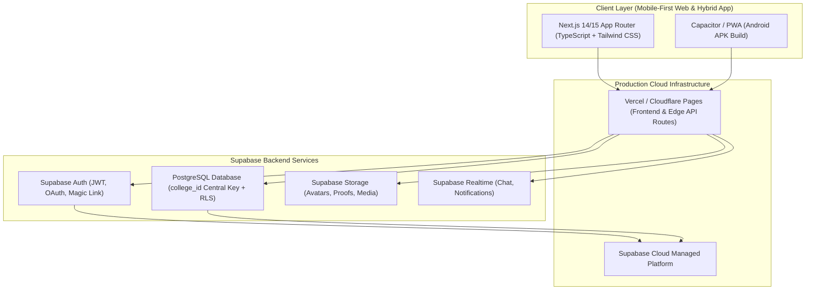
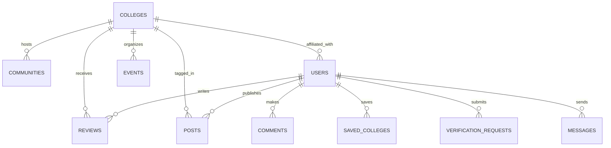

# Campus Lenz: Master Development & Online Cloud Hosting Plan

---

## 1. Executive Architecture & Hosting Overview

Campus Lenz is a unified, mobile-first, dark-glassmorphic college ecosystem combining **Discovery**, **Community**, and **Trust**.



---

## 2. Technology Stack & Production Alignment

| Component | Local Development Stack | Production Online Hosting |
| :--- | :--- | :--- |
| **Framework** | Next.js (App Router), React 18/19, TypeScript | **Vercel** (Global Edge CDN, Serverless Functions) |
| **Styling** | Tailwind CSS + Lucide Icons + Glassmorphism UI | Optimized Static Assets on Vercel CDN |
| **Database** | Supabase Local / Remote Dev Postgres | **Supabase Managed Cloud Postgres** (AWS Region) |
| **Authentication** | Supabase Auth + Local Fallback Mock | Supabase Auth (Email/Pass, OAuth, Verified Domains) |
| **Security & Policies** | Row-Level Security (RLS) SQL scripts | RLS Policies strictly enforced at Database layer |
| **Storage / CDN** | Supabase Storage Buckets (public/private) | Supabase Cloud Storage (S3-compatible, CDN-backed) |
| **Realtime Engine** | Supabase Realtime WebSocket | Supabase Realtime Server Cluster |
| **Mobile Target** | Mobile-First Web Viewport / Capacitor CLI | Android APK via Capacitor Android Studio Build |

---

## 3. Database Core Data Model & Constraints

The central anchor of the platform is **`college_id`**:



### Key Entities
1. `profiles`: `id (uuid, FK auth.users)`, `role (student, alumni, institution, admin)`, `full_name`, `avatar_url`, `college_id`, `department`, `graduation_year`, `is_verified`
2. `colleges`: `id`, `slug`, `name`, `location`, `state`, `type`, `fees_range`, `placement_stats`, `facilities`, `verified_official_id`
3. `reviews`: `id`, `college_id`, `user_id`, `reviewer_type`, `overall_rating`, `dimension_ratings (jsonb)`, `pros`, `cons`, `advice`, `status`
4. `posts`: `id`, `author_id`, `college_id`, `content`, `media_urls`, `likes_count`, `visibility`, `is_anonymous`
5. `communities`: `id`, `name`, `college_id`, `creator_id`, `type (public/private)`, `members_count`
6. `messages` & `conversations`: Direct messaging with `message_requests` validation gate.
7. `verification_requests`: Document proofs for Alumni & Institution verification handled by Admins.

---

## 4. Phase-by-Phase Local Development Roadmap

### Phase 1: Foundations & Design System Shell
- Initialize Next.js project with TypeScript, Tailwind CSS, Lucide icons.
- Configure color tokens:
  - Background: `#07111F`
  - Surface: `#112238`
  - Surface Variant: `#162D4A`
  - Accent Mint: `#38E6A5` & `#70F3C1`
- Build the core app shell: mobile bottom navigation bar, top app bar, responsive desktop sidebar, authentication session provider.

### Phase 2: Auth, Multi-Role Onboarding & Trust Isolation
- Implement Supabase Auth (Sign Up / Sign In) with role selector (Student, Alumni, Institution).
- Role-specific onboarding flow.
- Separation of concerns:
  - *Authentication* (who is logging in)
  - *Verification* (evidence proof review)
  - *Moderation* (UGC review)

### Phase 3: College Discovery & Comparison (Core Discovery Layer)
- Explore search page with multi-facet filtering (location, stream, fees, rating).
- College profile pages (`/colleges/[slug]`) separating **Official Data** from **Community Evidence**.
- Comparison matrix (up to 3 colleges side-by-side across academic, placement, hostel dimensions).

### Phase 4: Structured Reviews & Rating Engine
- Multi-dimensional review submission (Academics, Faculty, Placements, Infrastructure, Hostel, Value for money).
- Honest data rule: explicit *"Information not available yet"* or *"Not enough data"* flags without synthetic AI scoring.
- Anonymous/pseudonymous toggle with internal author audit trail.

### Phase 5: Social Feed & Community Hub
- College-centric and global campus feeds.
- Posts, comments, likes, bookmarking, and moderation report hooks.
- Alumni-created communities and moderated join requests.

### Phase 6: Direct Messaging & Guardrails
- Message request gate (`Request -> Accept -> Chat`) to prevent spam.
- 1-on-1 and group discussions.

### Phase 7: Verification & Admin Governance Portal
- Institution content management (courses, announcements, review responses).
- Admin queue for verifying alumni graduation proofs and institution authorizations.
- Content moderation dashboard.

---

## 5. Transition to Online Hosting (Deployment Plan)

### Step 1: Remote Supabase Cloud Setup
1. Create a Supabase Cloud project in the closest region (e.g., `ap-south-1` Mumbai / India).
2. Apply standard migration scripts:
   - Schema definitions (`schema.sql`)
   - Seed data for verified colleges (`seed.sql`)
   - Storage buckets configuration: `avatars`, `post_media`, `verification_proofs` (private)
   - Enable Row Level Security (RLS) on all tables with explicit policies.

### Step 2: Vercel Production Deployment
1. Connect GitHub repository to **Vercel**.
2. Configure production environment variables:
   ```env
   NEXT_PUBLIC_SUPABASE_URL=https://<project-ref>.supabase.co
   NEXT_PUBLIC_SUPABASE_ANON_KEY=<anon-key>
   SUPABASE_SERVICE_ROLE_KEY=<service-role-key-for-admin-routes>
   NEXT_PUBLIC_SITE_URL=https://campuslenz.vercel.app
   ```
3. Set build commands (`npm run build`) and test automated preview branch deployments.

### Step 3: Domain & SSL Configuration
- Bind custom production domain (e.g., `campuslenz.com` or custom domain via DNS CNAME/A records).
- Automated SSL/TLS cert issuance via Vercel Edge Network.

### Step 4: Hybrid Mobile App / APK Generation
- Integrate Capacitor:
  ```bash
  npm i @capacitor/core @capacitor/cli @capacitor/android
  npx cap init "Campus Lenz" "com.campuslenz.app"
  npx cap add android
  ```
- Build production assets (`npm run build && npx cap sync android`).
- Generate signed production Android APK via Android Studio / Gradle.

---

## 6. Development Discipline (Rules of Engagement)
- **Zero-Breakage Baseline:** Every phase must pass TypeScript typechecking (`tsc --noEmit`) and Next.js build (`npm run build`).
- **No Hallucinated Data:** Default states must explicitly say *"Information not available yet"* when data is missing.
- **Mobile-First UX:** Glassmorphic mobile viewport tested at 375px–430px before desktop scaling.
