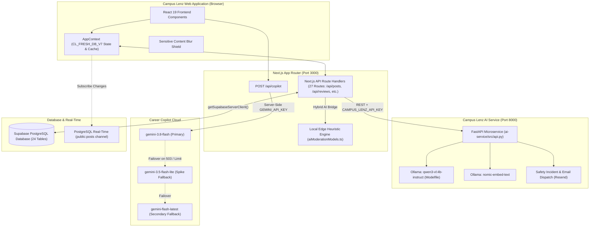
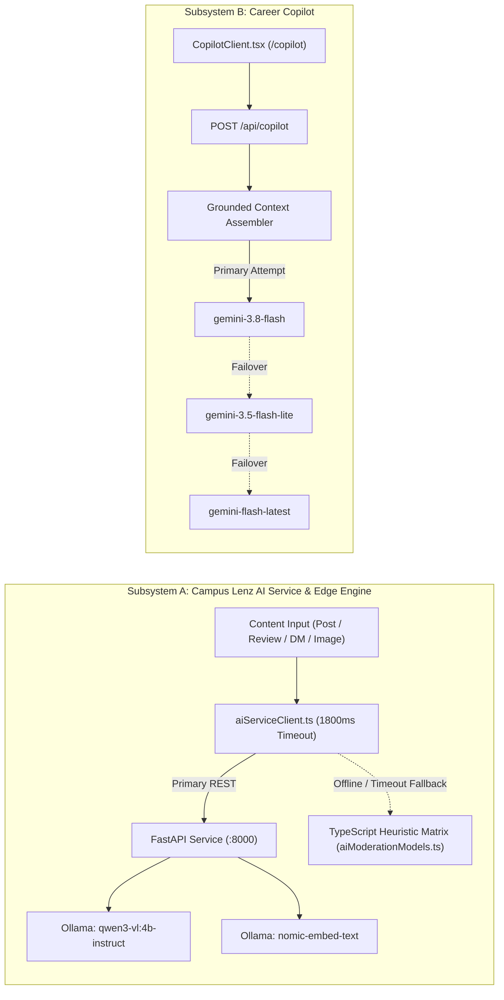
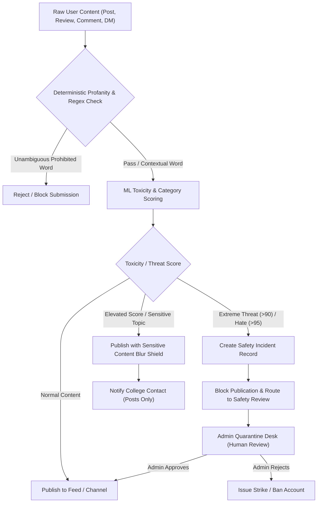
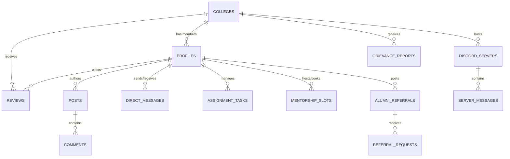

# Campus Lenz

> **The Unified Higher Education Ecosystem & Campus Intelligence Platform**<br />
> An integrated web platform connecting prospective and enrolled students, alumni mentors, academic faculty, and college administrators through authentic peer reviews, multi-dimensional college discovery, real-time campus community channels, dual-layer AI content moderation, and grounded career preparation intelligence.

---

## Table of Contents

1. [Project Overview & Vision](#1-project-overview--vision)
2. [Problem Statement](#2-problem-statement)
3. [The Campus Lenz Solution](#3-the-campus-lenz-solution)
4. [Core Platform Features](#4-core-platform-features)
   - [College Discovery, Search & Filtering](#college-discovery-search--filtering)
   - [Multi-Dimensional College Comparison & Rankings](#multi-dimensional-college-comparison--rankings)
   - [Authentic Review & Aspect-Based Sentiment System](#authentic-review--aspect-based-sentiment-system)
   - [Campus Social Platform & Role Feeds](#campus-social-platform--role-feeds)
   - [Communities, Servers & Real-Time Communication](#communities-servers--real-time-communication)
   - [Student Academic Features Hub](#student-academic-features-hub)
   - [Alumni Mentorship & Opportunity Network](#alumni-mentorship--opportunity-network)
   - [Faculty Academic Desk](#faculty-academic-desk)
   - [Institutional Administration & Broadcasts](#institutional-administration--broadcasts)
   - [Confidential Grievance & Anti-Ragging Desk](#confidential-grievance--anti-ragging-desk)
   - [Platform Administration & Governance Console](#platform-administration--governance-console)
   - [Career Copilot AI Placement Strategist](#career-copilot-ai-placement-strategist)
5. [User Roles & Permissions](#5-user-roles--permissions)
6. [User Journeys & Product Flows](#6-user-journey--product-flows)
7. [Authentication, Authorization & Verification](#7-authentication-authorization--verification)
8. [System Architecture](#8-system-architecture)
9. [AI Architecture](#9-ai-architecture)
   - [Subsystem A: Campus Lenz AI Service (Ollama / Qwen3-VL & Nomic)](#subsystem-a-campus-lenz-ai-service)
   - [Subsystem B: Local Edge Fallback Engine (TypeScript Heuristic Matrix)](#subsystem-b-local-edge-fallback-engine)
   - [Subsystem C: Career Copilot (Google Gemini Placement Strategist)](#subsystem-c-career-copilot)
10. [AI Safety, Moderation & Trust Principles](#10-ai-safety-moderation--trust-principles)
11. [Technology Stack](#11-technology-stack)
12. [Database Architecture](#12-database-architecture)
13. [API Route Reference](#13-api-route-reference)
    - [Next.js App Router API Routes (27 Route Files)](#nextjs-app-router-api-routes)
    - [Python FastAPI AI Service Routes (10 Routes)](#python-fastapi-ai-service-routes)
14. [Repository Directory Structure](#14-repository-directory-structure)
15. [Environment Variables & Configuration](#15-environment-variables--configuration)
16. [Local Development & Setup Guide](#16-local-development--setup-guide)
17. [Testing & Verification](#17-testing--verification)
18. [Security & Privacy Model](#18-security--privacy-model)
19. [Known Technical Limitations](#19-known-technical-limitations)
20. [Implemented vs. Partially Implemented vs. Planned Features](#20-implemented-vs-partially-implemented-vs-planned-features)
21. [Roadmap & Future Scope](#21-roadmap--future-scope)
22. [Development Workflow & Contributing](#22-development-workflow--contributing)
23. [License & Project Status](#23-license--project-status)

---

## 1. Project Overview & Vision

### Vision
Campus Lenz is conceived as a digital operating system for higher education. Rather than treating college selection, student socialization, academic coordination, alumni networking, and career placement as disconnected applications, Campus Lenz unifies the entire collegiate journey into a single interconnected platform.

```
       COLLEGE DISCOVERY & BENCHMARKING
                       │
                       ▼
          AUTHENTIC PEER REVIEWS & ABSA
                       │
                       ▼
       CAMPUS FEEDS & DISCORD-STYLE SERVERS
                       │
                       ▼
      STUDENT ACADEMIC HUB & FOCUS ROOMS
                       │
                       ▼
    ALUMNI MENTORSHIP & FACULTY OFFICE HOURS
                       │
                       ▼
      CAREER COPILOT PLACEMENT STRATEGIST
                       │
                       ▼
   INSTITUTIONAL GOVERNANCE & GRIEVANCE DESK
```

### Target Users
- **Prospective Students & Parents**: Evaluating colleges using verified peer reviews, placement statistics, fee breakdowns, and side-by-side comparative benchmarking.
- **Enrolled University Students**: Engaging in campus discussions, joining virtual study rooms, tracking coursework and exams, reserving marketplace items, consulting faculty, and preparing for campus placement drives.
- **Alumni Mentors**: Giving back to their alma mater through bookable 1:1 mentorship sessions, verified job referrals, and industry Ask-Me-Anything (AMA) forums.
- **Academic Faculty**: Managing virtual office hour queues, reviewing student research lab applications, distributing versioned lecture notes, and issuing departmental circulars.
- **College Administrators**: Broadcasting high-priority emergency alerts, governing institutional Discord-style servers, approving faculty community requests, and addressing formal student grievances.
- **Platform Administrators**: Monitoring system telemetry, adjusting AI moderation thresholds, adjudicating quarantined posts, and supervising overall platform safety.

---

## 2. Problem Statement

Higher education discovery, governance, and campus life in India face acute structural challenges:

1. **Information Asymmetry in College Selection**: Institutional brochures and commercial educational portals frequently showcase unverified placement packages and promotional imagery. Prospective students lack trustworthy insight into actual mess food quality, hostel curfews, lab equipment condition, and realistic Return on Investment (ROI).
2. **Superficial Ranking Systems**: Mainstream ranking systems assign single scalar ranks that obscure granular trade-offs. Students cannot easily benchmark institutions across specific operational dimensions such as faculty-student ratios, tier-1 tech hiring percentages, and annual tuition.
3. **Fragmented & Unmoderated Campus Discussions**: Student discussions occur across fragmented third-party chat groups and anonymous boards prone to cyberbullying, harassment, and ragebait.
4. **Disconnected Alumni Networks**: Alumni networks remain isolated on general professional networks where junior-to-senior outreach lacks collegiate verification, resulting in sporadic mentorship and inaccessible referral pipelines.
5. **Academic Task & Focus Isolation**: Students lack integrated peer focus environments, collaborative course Q&A forums, and campus marketplace tools built directly into their student portal.
6. **Ineffective Grievance Reporting**: Formal paper-based or public grievance channels can intimidate students, resulting in under-reporting of ragging, harassment, academic bias, and hostel infrastructure failures.
7. **Disjointed Placement Preparation**: Students approach campus recruitment without personalized roadmaps that connect their degree coursework, current technical skills, and college-specific hiring histories.

---

## 3. The Campus Lenz Solution

Campus Lenz addresses these challenges through a unified, role-aware web architecture:

- **Evidence-Based Discovery & Benchmarking**: Granular institutional profiles featuring an extensive regional dataset of engineering colleges (starting with Tamil Nadu) evaluated across 5 core pillars: Placements, Fees & ROI, Academics, Campus Amenities, and Student Activities.
- **Audited Student Reviews with ABSA**: Reviews evaluated across 8 distinct dimensions, supported by automated Aspect-Based Sentiment Analysis (ABSA) and institutional reply threads.
- **Dual-Stream Moderated Social Feed**: Campus discussion streams allowing students, alumni, and faculty to share knowledge, filterable by role and topic, protected by automated multi-label toxicity checks and sensitivity blur shields.
- **Real-Time Community Servers**: Discord-style servers organized by department, clubs, and placement cells, alongside direct 1:1 messaging protected by privacy-safe preflight checks.
- **Integrated Academic Workspace**: Synchronized virtual study rooms with Pomodoro timers, subject-specific course Q&A with community upvoting, campus item reservations, and semester exam milestone countdowns.
- **Alumni Mentorship & Referral Gateway**: Anti-spam verified mentorship scheduling, corporate job referral pipelines, and industry AMA events.
- **Confidential Grievance Portal**: Secure, tracking-enabled grievance escalation with anonymous submission support, unique ticket tracking IDs (`GRV-XXXXXX`), and status lifecycle monitoring.
- **Career Copilot**: An AI placement strategist powered by Google Gemini that generates personalized placement preparation roadmaps grounded in the student's degree, target role, current skills, college hiring benchmarks, and academic coursework.

---

## 4. Core Platform Features

### College Discovery, Search & Filtering
- **College Directory**: Comprehensive directory of higher education institutions with specialized regional depth across Tamil Nadu engineering colleges ([`src/lib/tamilNaduColleges.ts`](file:///c:/campuslenzapp/src/lib/tamilNaduColleges.ts)).
- **Multi-Parameter Search**: Instant full-text search across college names, short codes, districts, and affiliated departments.
- **Regional & Categorical Filters**: Filter institutions by region (Chennai, Coimbatore, Madurai, Trichy, Salem, Southern TN), governance type (Autonomous, Government, Govt-Aided, Private), fee ranges, and student satisfaction ratings.
- **Detailed College Profiles (`/colleges/[slug]`)**: Exhaustive institutional dashboards displaying official overviews, accreditation details, contact details, facilities, historical placement trends, and full review histories.

### Multi-Dimensional College Comparison & Rankings
- **Side-by-Side Comparison (`/compare`)**: Direct comparative benchmarking of 2 or 3 colleges across 5 standardized pillars:
  - *Placements & Job Offers*: Highest CTC, average CTC, median CTC, overall placement percentage, top recruiters, and tier-1 tech hiring counts.
  - *Fees & ROI*: Annual tuition, annual hostel fee, monthly mess costs, available scholarships, and overall Return-On-Investment score.
  - *Academics & Faculty*: Faculty-student ratio, Ph.D. faculty percentage, curriculum revision frequency, and accreditation grades (NAAC/NBA).
  - *Campus & Hostel Amenities*: Hostel Wi-Fi bandwidth, curfew times, mess food ratings, and proximity to emergency medical centers.
  - *Activities & Ecosystem*: Annual technical symposiums, hackathons per year, active student clubs, and funded incubation centers.
- **Objective Scoring & Badges**: Institutions receive calculated dimensional scores and category badges (e.g. *Tier 1 Elite Tech*, *Top ROI Engineering*, *High Research Output*) calculated from verifiable benchmarks ([`src/types/index.ts#L162-L169`](file:///c:/campuslenzapp/src/types/index.ts#L162-L169)).

### Authentic Review & Aspect-Based Sentiment System
- **8-Dimension Rating Scale**: Scores rated from 1 to 5 stars for *Academics*, *Faculty*, *Placements*, *Infrastructure*, *Hostel*, *Campus Life*, *Value for Money*, and *Student Experience*.
- **Structured Feedback Fields**: Review title, detailed experience narrative, pros list, cons list, advice to juniors, course, department, graduation batch, and an optional anonymity toggle.
- **Aspect-Based Sentiment Tagging**: Reviews are processed by the AI pipeline to detect mentioned aspects and classify aspect-specific sentiment (positive, negative, neutral).
- **Official Institutional Replies**: College administration accounts can publish formal responses attached directly to student reviews.

### Campus Social Platform & Role Feeds
- **Stream Filtering**: Switch between *All Feeds*, *Student Stream*, *Campus Feed*, *Alumni Feed*, and *Faculty Feed*.
- **Post Authoring**: Text posts with media URL attachments (images, video embeds), designated academic topics, and author verification indicators.
- **Social Engagement**: Instant likes, threaded comments, bookmarking/saving, and reposting directly to institutional feeds.
- **Preflight Moderation**: Content is screened against deterministic profanity rules and toxicity thresholds prior to publication.

### Communities, Servers & Real-Time Communication
- **Discord-Style Servers (`/servers`)**: Hierarchical server directory with categorized channels (`#general`, `#announcements`, `#placements`, `#code-collab`).
- **Channel Chat**: Real-time channel messaging with author role badges and message history.
- **Direct 1:1 Messaging (`/messages`)**: Private communication between students, alumni, and faculty, with built-in toxicity preflight screening.

### Student Academic Features Hub
- **Virtual Study Rooms**: Focus rooms equipped with synchronized Pomodoro timers, subject tags, and participant counters.
- **Course Q&A**: Question and answer forum organized by course code, featuring community upvotes and verified faculty answers.
- **Campus Marketplace**: Peer-to-peer textbook, calculator, and dorm gear reservations (`available`, `reserved`).
- **Academic Task Tracker**: Personal assignment tracker with urgency indicators and countdown milestones for upcoming semester exams.

### Alumni Mentorship & Opportunity Network
- **Alumni Mentorship Slots**: Alumni create bookable 1:1 mentorship sessions specifying topic, date, time, and meeting URL.
- **Job Referrals**: Alumni post verified job opportunities with experience requirements; students can apply directly by attaching roll numbers, resumes, and portfolios.
- **Industry AMAs**: Structured Ask-Me-Anything sessions with community question upvoting.
- **Anti-Spam Rate Limiting**: Mentorship post authoring enforces minimum follower requirements and weekly post limits (`checkAlumniPostEligibility`).

### Faculty Academic Desk
- **Office Hours Queue**: Real-time virtual queue allowing professors to admit, consult, and resolve waiting students.
- **Research Lab Openings**: Faculty post undergraduate research positions; students submit applications (GPA, statement of interest, CV link) for faculty review.
- **Lecture Materials Repository**: Distribution of versioned lecture notes, syllabus updates, and course references.
- **Community Requests**: Faculty can request the institution to provision dedicated departmental servers.

### Institutional Administration & Broadcasts
- **Emergency Broadcast Banner**: High-priority alert banner triggered across all active client sessions ([`src/components/EmergencyBroadcastBanner.tsx`](file:///c:/campuslenzapp/src/components/EmergencyBroadcastBanner.tsx)).
- **Community Governance**: Reviewing, approving, and rejecting faculty community requests.
- **Official Review Replies**: Authoring institutional administrative responses to campus reviews.
- **Reported Content Desk**: Reviewing flagged campus posts and tracking campus engagement telemetry.

### Confidential Grievance & Anti-Ragging Desk
- **Confidential Reporting (`/grievance`)**: Secure reporting pipeline for ragging, harassment, academic bias, and campus maintenance failures.
- **Tracking System**: Submissions generate a unique tracking ID (`GRV-XXXXXX`) allowing students to monitor ticket lifecycle states (`submitted`, `under_investigation`, `resolved`, `action_taken`) and review administrative resolution notes.

### Platform Administration & Governance Console
- **Root Admin Console (`/admin`)**: System dashboard with live AI service health telemetry.
- **AI Moderation Sandbox**: Interactive testing sandbox for text sentiment, toxicity, review aspects, review summarization, duplicate detection, and image analysis.
- **Threshold Sliders**: Live configuration of auto-ban thresholds, sensitive content blur thresholds, and auto-ban triggers.
- **User Moderation Controls**: Account striking, banning, unbanning, and deletion.
- **Admin Terminal**: Command-line administrative interface executing operational commands (`status`, `users`, `posts`, `quarantine`, `audit`, `sync`, `flush`).

### Career Copilot AI Placement Strategist
- **UI Experience (`/copilot`)**: Interactive placement strategist interface featuring a student passport, quick prompt pills, role presets, and ecosystem action links.
- **Student Career Profile**: Embedded state tracking `targetRole`, `skills`, `currentLearning`, `completedLearning`, and `updatedAt`.
- **Grounded Prompting**: Calls Google Gemini (`@google/genai`) with live student context, academic coursework deadlines, and college placement benchmarks.

---

## 5. User Roles & Permissions

The platform implements six explicit role classifications defined in [`src/types/index.ts#L1`](file:///c:/campuslenzapp/src/types/index.ts#L1):

```typescript
export type UserRole = 'student' | 'alumni' | 'institution' | 'faculty' | 'staff' | 'admin';
```

| Role | Portal / View | Permissions & Core Capabilities |
| :--- | :--- | :--- |
| **`student`** | Main Feed (`/?stream=students`), Student Hub, `/copilot` | Browse/compare colleges, author reviews, publish posts/comments, join study rooms, ask course questions, reserve marketplace items, track assignments/exams, submit confidential grievances, use Career Copilot. |
| **`alumni`** | Alumni Home View ([`src/components/home/AlumniHomeView.tsx`](file:///c:/campuslenzapp/src/components/home/AlumniHomeView.tsx)) | Publish career mentorship posts (subject to follower threshold and weekly post limits), create 1:1 mentorship slots, post job referrals, review student referral requests, host AMAs. |
| **`faculty`** | Faculty Academic Desk ([`src/components/home/FacultyHomeView.tsx`](file:///c:/campuslenzapp/src/components/home/FacultyHomeView.tsx)) | Publish departmental circulars, manage virtual office hour queues, post research lab openings, review student research applications, upload versioned lecture notes, request new servers. |
| **`institution`** | Campus Admin Gateway ([`src/components/home/InstitutionHomeView.tsx`](file:///c:/campuslenzapp/src/components/home/InstitutionHomeView.tsx), `/servers`) | Trigger high-priority emergency broadcast banners, approve/reject faculty community requests, publish official replies to college reviews, review reported posts, govern institutional servers. |
| **`staff`** | Recognized role in data models & authentication | Administrative staff, lab superintendents, and facility coordinators (`officeTitle`, `aisheCode`, `facultyStaffId`). |
| **`admin`** | Root Admin Console (`/admin`) | Platform telemetry, AI moderation threshold configuration, quarantine queue adjudication, user account striking/banning/deletion, audit log inspection, admin terminal execution. |

---

## 6. User Journeys & Product Flows

### Student End-to-End Discovery to Placement Flow
```
1. Discovery & Evaluation
   Visit /explore or /compare ──> Search colleges ──> Review 5-pillar benchmarks ──> Read multi-dimensional reviews

2. Campus Life & Collaboration
   Register / Login as Student ──> Join campus servers ──> Participate in study rooms ──> Track assignments & exams

3. Career Mentorship & Placement Readiness
   Configure Career Profile (target role, skills, learning) ──> Consult Career Copilot AI (/copilot)
   ──> Receive phased roadmap grounded in campus recruitment data ──> Book 1:1 Alumni Mentorship slot
```

### Review Submission & AI Aspect Analysis Flow
```
Student submits review (1-5 stars across 8 dimensions + pros/cons + advice)
   │
   ▼
POST /api/reviews
   │
   ├──> AI Aspect Analysis (analyzeReviewAspects) extracts mentioned topics & sentiments
   ├──> Review saved to Supabase 'reviews' table (or local CL_FRESH_DB_V7 cache)
   │
   ▼
Review published on College Profile page (/colleges/[slug])
   │
   ▼
Institution Admin views review ──> Posts institutional reply attached to review thread
```

### Post Creation, Preflight Moderation & Quarantine Flow
```
User writes post (text + optional image/video URL) ──> Clicks "Publish"
   │
   ▼
POST /api/posts
   │
   ├──> Strict profanity check (policy_filter.py / local heuristic rules)
   │     └──> Contains prohibited terms ──> Immediate rejection
   │
   ├──> ML toxicity & threat scoring (unitary/toxic-bert rule matrix)
   │     ├──> Severe threat (>90) or hate speech (>95) ──> Blocked, safety incident logged
   │     ├──> Elevated toxicity / sensitive content ──> Published with Sensitive Content Blur Shield
   │     └──> Normal content ──> Published immediately
   │
   ▼
If flagged for safety review: Routed to Admin Quarantine Queue (/admin) for human adjudication
```

### Confidential Grievance Lifecycle Flow
```
Student submits grievance (/grievance) ──> Selects category, urgency, and optional anonymity
   │
   ▼
POST /api/grievances
   │
   ├──> Generates unique tracking code (GRV-XXXXXX)
   ├──> Stored in 'grievance_reports' table with status: "submitted"
   │
   ▼
College Admin / Anti-Ragging Cell reviews report ──> Updates status to "under_investigation"
   │
   ▼
Investigation completed ──> Admin enters resolution notes ──> Status updated to "resolved" / "action_taken"
   │
   ▼
Student verifies resolution status using tracking code without compromising confidentiality
```

---

## 7. Authentication, Authorization & Verification

Campus Lenz maintains strict distinctions between authentication, authorization, and institutional verification:

- **Authentication**: Verifies user identity via portal-based credentials (`loginUser`, `registerUser` in [`src/lib/AppContext.tsx`](file:///c:/campuslenzapp/src/lib/AppContext.tsx)) and Supabase Auth client helpers ([`src/utils/supabase/client.ts`](file:///c:/campuslenzapp/src/utils/supabase/client.ts), [`src/utils/supabase/server.ts`](file:///c:/campuslenzapp/src/utils/supabase/server.ts)).
- **Authorization**: Restricts capabilities according to the user's role. For example, only accounts with `role: 'admin'` can access the Root Admin Console (`/admin`) and execute terminal commands; only `role: 'institution'` can broadcast emergency alerts; and `role: 'alumni'` post authoring is guarded by follower and quota checks.
- **Verification**: The data model defines verification status (`isVerified: boolean` on profiles and `isVerifiedAuthor` on posts/reviews) to distinguish verified campus members, with a `VerificationRequest` interface defined for future document-based verification workflows. Currently, verification badges are assigned via profile attributes rather than an automated document-processing pipeline.

---

## 8. System Architecture

The platform architecture clearly separates the main web application from the local AI microservice and the external Google Gemini integration:



---

## 9. AI Architecture

Campus Lenz employs two distinct, specialized AI subsystems designed for high availability, content trust, and student career acceleration.



### Subsystem A: Campus Lenz AI Service
The external Python service runs on port 8000 ([`ai-service/src/api.py`](file:///c:/campuslenzapp/ai-service/src/api.py)) and interfaces with local Ollama models:
- **Vision & Language Model (`qwen3-vl:4b-instruct`)**: Configured via [`ai-service/Modelfile`](file:///c:/campuslenzapp/ai-service/Modelfile) with strict system instructions to output JSON only. Executes:
  - *Post Analysis*: Classifies post topic category, sentiment, and moderation tier.
  - *Review Analysis*: Extracts mentioned aspects (Academics, Faculty, Placements, Infrastructure, Hostel, Campus Life, Value for Money, Student Experience) and scores aspect sentiment.
  - *Review Summarization*: Synthesizes up to 100 student reviews into positive highlights and negative points.
  - *Image Understanding & OCR*: Categorizes campus images, evaluates college relevance, and extracts readable text into OCR strings.
- **Embedding Model (`nomic-embed-text`)**: Generates vector embeddings via Ollama (`http://localhost:11434/api/embed`) for:
  - *Semantic College Search*: Vector proximity search against college profiles.
  - *Duplicate Content Detection*: Vector cosine similarity scoring using an empirical baseline threshold of `0.85`.
- **Policy & Incident Dispatch**: Automatically records safety incidents and dispatches email alerts to college administrative contacts via Resend ([`ai-service/src/notification_service.py`](file:///c:/campuslenzapp/ai-service/src/notification_service.py)).

### Subsystem B: Local Edge Fallback Engine
Implemented in [`src/lib/aiModerationModels.ts`](file:///c:/campuslenzapp/src/lib/aiModerationModels.ts) and bridged via [`src/lib/aiServiceClient.ts`](file:///c:/campuslenzapp/src/lib/aiServiceClient.ts):
- A zero-dependency TypeScript heuristic matrix modeled on the behavior of `distilbert-sst-2`, `unitary/toxic-bert`, and `nsfwjs-mobilenet-v2`.
- Uses regular expressions, curated lexicons, and token-based similarity calculations to execute sentiment analysis, multi-label toxicity checks, aspect extraction, and duplicate detection.
- Automatically engages if the Python AI service or Ollama is offline or times out (1800ms threshold), guaranteeing uninterrupted platform operation.

### Subsystem C: Career Copilot
Implemented across [`src/app/copilot/CopilotClient.tsx`](file:///c:/campuslenzapp/src/app/copilot/CopilotClient.tsx) and [`src/app/api/copilot/route.ts`](file:///c:/campuslenzapp/src/app/api/copilot/route.ts):
- **SDK**: Official `@google/genai` TypeScript SDK (v2.24.0).
- **Cascading Fallback Chain**:
  1. `gemini-3.8-flash` (Primary reasoning model)
  2. `gemini-3.5-flash-lite` (Automatic failover during transient spikes or 503 high-demand events)
  3. `gemini-flash-latest` (Secondary fallback)
- **Grounded Context Injection**: The server builds a comprehensive system prompt incorporating live student data:
  - Student identity: Name, college, department, degree course, graduation batch year.
  - Career profile: Target role, current skills, learning topics in progress, completed milestones.
  - Institutional placement baselines: Average CTC, highest CTC, top recruiters, tier-1 placement counts.
  - Academic deadlines: Current assignment deliverables and days remaining to semester examinations.
- **Strict Behavioral Safeguards**: The model is instructed to conduct objective skill gap analysis, build phased timelines, suggest Campus Lenz platform actions (alumni mentorship, study rooms), and avoid guaranteeing employment or specific salaries.
- **Server-Side Security**: The `GEMINI_API_KEY` is read strictly on the server and is never exposed to the client browser.

---

## 10. AI Safety, Moderation & Trust Principles

Campus Lenz enforces a multi-tier trust and safety architecture combining deterministic rules, machine learning classifications, and human administrative authority:



### Safety Tiers
- **Normal**: Safe collegiate content; published immediately.
- **Sensitive**: Contains sensitive disclosures or controversial campus feedback; published with an automated **Sensitive Content Blur Shield** requiring user click-to-view.
- **Spam**: Repetitive, promotional, or off-topic content; rejected.
- **Potentially Harmful**: Severe harassment, direct threats of violence, or hate speech; blocked from publication and routed to the internal Safety Review desk.

### Deterministic & Contextual Profanity Filters
- Maintains a 48-term strict profanity dictionary with natural plural expansions ([`ai-service/src/policy_filter.py`](file:///c:/campuslenzapp/ai-service/src/policy_filter.py)).
- Contextual filtering evaluates ambiguous terms (`hell`, `damn`, `cocky`, `bloody`) to distinguish hostile abuse (`go to hell`) from legitimate colloquial feedback (`hostel food is damn bad`).

### Direct Message Privacy Safeguards
- When private direct messages trigger safety flags, an internal safety incident is created for platform administrators, but notifications are **never sent to college administrators**, preserving student communication privacy.

### Human-in-the-Loop Governance
- The AI engine never autonomously bans or deletes user accounts. Extreme violations generate recommendations (`actionRecommended: 'auto_ban'` or `'quarantine'`), leaving final adjudication to human administrators via the Admin Console.

---

## 11. Technology Stack

### Frontend
- **Framework**: Next.js 16.3.6 (App Router, Server Components & Route Handlers)
- **UI Library**: React 19.2.8 & React DOM 19.2.8
- **Language**: TypeScript 5
- **Styling**: Tailwind CSS 4 (`@tailwindcss/postcss`) with custom glassmorphic design tokens
- **Animations**: Framer Motion 13.4.4
- **Icons**: Lucide React 1.48.0
- **Utilities**: `clsx` 2.1.1, `tailwind-merge` 3.7.0

### Backend & Database
- **API Engine**: Next.js Route Handlers (`src/app/api/*`)
- **Microservice Framework**: Python FastAPI 0.141.1, Uvicorn 0.54.0
- **Database Engine**: PostgreSQL managed via Supabase
- **Client Libraries**: `@supabase/supabase-js` 2.117.2, `@supabase/ssr` 0.12.7
- **Rate Limiting**: SlowAPI 0.1.10, Limits 5.8.0

### AI & Machine Learning
- **Career Copilot**: Google Gemini API via `@google/genai` (v2.24.0)
- **Local LLM Engine**: Ollama running `qwen3-vl:4b-instruct` (customized via `Modelfile`)
- **Embedding Model**: Ollama running `nomic-embed-text`
- **Email Notifications**: Resend 2.48.0
- **Edge Heuristics**: Custom TypeScript neural-rule matrix ([`src/lib/aiModerationModels.ts`](file:///c:/campuslenzapp/src/lib/aiModerationModels.ts))

---

## 12. Database Architecture

The database architecture is defined in [`supabase_schema.sql`](file:///c:/campuslenzapp/supabase_schema.sql) and consists of **exactly 24 PostgreSQL tables**:



### Complete Table Catalog (24 Tables)
1. **`colleges`**: Institutional profiles, accreditation, nested placement statistics, fee breakdowns, and campus amenities.
2. **`profiles`**: User profiles for students, alumni, faculty, institutions, staff, and admins, storing verification status, strike history, and followers.
3. **`reviews`**: 8-dimension student reviews, pros/cons, advice, and official institutional replies.
4. **`posts`**: Campus social posts with topics, media URLs, like arrays, repost tracking, sentiment scores, and moderation flags.
5. **`comments`**: Threaded discussion comments on posts.
6. **`communities`**: Discovery records for campus community hubs.
7. **`discord_servers`**: Server definitions containing channel structures and anti-ragebait rules.
8. **`server_messages`**: Real-time chat messages sent in server channels.
9. **`grievance_reports`**: Confidential reports with tracking codes (`GRV-XXXXXX`), category tags, and resolution notes.
10. **`direct_messages`**: Private 1:1 direct messages with confidentiality controls and safety review suppression.
11. **`study_rooms`**: Focus rooms with Pomodoro timers, subject topics, and active participant counters.
12. **`course_questions`**: Coursework Q&A forum entries with community upvotes and answers.
13. **`marketplace_items`**: Student listings for textbooks, calculators, and dorm gear.
14. **`assignment_tasks`**: Individual academic assignments with urgency flags and completion states.
15. **`exam_milestones`**: Semester examination date countdowns.
16. **`mentorship_slots`**: Bookable 1:1 alumni mentorship meeting slots.
17. **`alumni_referrals`**: Corporate job opportunities posted by verified alumni.
18. **`referral_requests`**: Student applications for alumni job referrals.
19. **`ama_events`**: Scheduled industry AMA forums with community questions.
20. **`office_hour_queue`**: Virtual waiting queue for faculty office hour consultations.
21. **`research_openings`**: Undergraduate research positions posted by faculty.
22. **`lecture_materials`**: Versioned academic course notes and references.
23. **`emergency_broadcasts`**: High-priority campus alert broadcasts.
24. **`audit_logs`**: System security and administrative governance audit trail.

---

## 13. API Route Reference

### Next.js App Router API Routes
The repository implements **exactly 27 route files** (`src/app/api/**/*.ts`):

#### AI & Moderation (6 Route Files)
- `GET /api/ai/status` — Retrieves diagnostic health status for the external FastAPI service and local edge engines.
- `POST /api/ai/analyze-post` — Evaluates post content for sentiment, category, toxicity, and policy compliance.
- `POST /api/ai/analyze-message` — Preflight toxicity and threat analysis for private direct messages.
- `POST /api/ai/summarize-reviews` — Synthesizes multiple reviews into a structured summary of positive and negative points.
- `POST /api/ai/detect-duplicate` — Calculates semantic similarity between two texts using vector cosine proximity.
- `POST /api/ai/semantic-search` — Performs semantic vector search across the college catalog.

#### Career Copilot (1 Route File)
- `POST /api/copilot` — Secure server-side endpoint connecting to Google Gemini (`gemini-3.8-flash` with cascading fallback) to deliver grounded student career mentorship and placement preparation plans.

#### Colleges & Discovery (2 Route Files)
- `GET /api/colleges` — Lists colleges with optional state, tier, and search query filters.
- `GET /api/colleges/[slug]` — Retrieves detailed college profile information by unique slug.

#### Social Feed & Posts (5 Route Files)
- `GET /api/posts` — Lists published campus posts with filtering by college, author role, and sentiment.
- `POST /api/posts` — Publishes a new post with automated AI preflight moderation and sensitivity evaluation.
- `GET /api/posts/[id]` — Retrieves a single post by ID.
- `DELETE /api/posts/[id]` — Deletes a post (author or administrator only).
- `POST /api/posts/[id]/comments` — Adds a threaded comment to a post.
- `POST /api/posts/[id]/like` — Toggles a user like on a post.
- `POST /api/posts/[id]/repost` — Toggles a repost of a post.

#### Reviews (1 Route File)
- `GET /api/reviews` — Retrieves reviews filtered by `collegeId` or `userId`.
- `POST /api/reviews` — Submits a multi-dimensional review with automated aspect sentiment tagging.

#### Communities & Messaging (3 Route Files)
- `GET /api/communities` — Lists available campus Discord-style servers.
- `POST /api/communities` — Creates a new campus community server.
- `GET /api/server-messages` — Retrieves chat history for a specific server channel.
- `POST /api/server-messages` — Sends a message to a server channel.
- `GET /api/direct-messages` — Retrieves 1:1 message history between two users.
- `POST /api/direct-messages` — Sends a private direct message after safety preflight check.

#### Academic & Student Tools (3 Route Files)
- `GET /api/study-rooms` — Lists active virtual study rooms and Pomodoro focus sessions.
- `POST /api/study-rooms` — Creates a new virtual study room.
- `GET /api/course-questions` — Lists course Q&A questions with answers and upvote counts.
- `POST /api/course-questions` — Submits a new course question or answer.
- `GET /api/marketplace` — Retrieves campus marketplace items.
- `POST /api/marketplace` — Creates a new marketplace listing.

#### Grievances (1 Route File)
- `GET /api/grievances` — Retrieves grievance reports (scoped by user or institution).
- `POST /api/grievances` — Submits a confidential grievance report generating a tracking code.

#### Users & Follow Network (3 Route Files)
- `GET /api/users` — Lists user profiles.
- `GET /api/users/[username]` — Retrieves a public user profile by username.
- `POST /api/users/[username]/follow` — Toggles follow/unfollow state between users.

#### Governance & Utilities (2 Route Files)
- `GET /api/audit-logs` — Retrieves platform administrative audit logs.
- `POST /api/seed` — Seeds Supabase database tables with initial college and user fixtures.

---

### Python FastAPI AI Service Routes
Defined in [`ai-service/src/api.py`](file:///c:/campuslenzapp/ai-service/src/api.py) (**10 total registered routes**: 2 health/infrastructure + 8 functional AI endpoints):

#### Infrastructure & Health (2 Routes)
- `GET /` — Returns service identity, version (`1.0.0`), and running status.
- `GET /health` — Service health probe endpoint.

#### Functional AI Endpoints (8 Routes)
- `POST /analyze/post` — Analyzes post sentiment, category, and moderation classification.
- `POST /moderate/post` — Decides policy action (`publish`, `safety_review`, `reject`) and creates incidents.
- `POST /analyze/review` — Aspect-based sentiment analysis for student reviews.
- `POST /moderate/review` — Moderation evaluation for student reviews.
- `POST /moderate/message` — Evaluates direct messages with privacy safeguards.
- `POST /analyze/summary` — Multi-review synthesis using Ollama.
- `POST /analyze/image` — Multimodal image categorization, OCR extraction, and relevance scoring.
- `POST /search/colleges` — Vector-based semantic college search.

---

## 14. Repository Directory Structure

```
campuslenzapp/
├── ai-service/                         # Python FastAPI AI Microservice
│   ├── src/
│   │   ├── api.py                      # FastAPI application, rate limiter & 10 routes
│   │   ├── moderation_engine.py        # Moderation logic & safety incident generator
│   │   ├── policy_filter.py            # Strict & contextual profanity dictionary
│   │   ├── post_analyzer.py            # LLM prompt & schema for post analysis
│   │   ├── review_analyzer.py          # LLM aspect-based sentiment analysis
│   │   ├── review_summarizer.py        # LLM multi-review synthesis
│   │   ├── image_analyzer.py           # Multimodal visual categorization & OCR
│   │   ├── embedding_service.py        # Ollama vector embeddings & cosine similarity
│   │   ├── duplicate_detector.py       # Cosine duplicate text scoring
│   │   ├── semantic_search.py          # College catalog semantic search
│   │   ├── notification_service.py     # Email notifications via Resend
│   │   └── safety_incident.py          # Safety incident data structures
│   ├── tests/                          # Python AI test suite & evaluation datasets
│   ├── Modelfile                       # Ollama custom system prompt & model definition
│   └── requirements.txt                # Python dependencies (FastAPI, uvicorn, resend)
│
├── public/                             # Static assets, logos & PWA icons
│
├── src/
│   ├── app/                            # Next.js App Router routes & pages
│   │   ├── page.tsx                    # Main landing & role feed container
│   │   ├── HomePageClient.tsx          # Feed streams, stories & shortcuts client
│   │   ├── layout.tsx                  # Root HTML layout & AppProvider wrapper
│   │   ├── globals.css                 # Tailwind CSS 4 global style definitions
│   │   │
│   │   ├── admin/                      # Platform administration & AI console
│   │   ├── colleges/[slug]/            # College detail profiles & reviews
│   │   ├── compare/                    # Multi-college comparative analytics
│   │   ├── connect/                    # Unified campus connection hub
│   │   ├── copilot/                    # Career Copilot placement strategist
│   │   ├── create/                     # Post & review creation studio
│   │   ├── explore/                    # College search & directory filtering
│   │   ├── grievance/                  # Confidential grievance submission & tracking
│   │   ├── login/                      # Portal-based authentication
│   │   ├── register/                   # Role-specific user registration
│   │   ├── messages/                   # Direct 1:1 user messaging
│   │   ├── profile/                    # User profile view & editor
│   │   ├── servers/                    # Discord-style campus server browser
│   │   ├── user/[username]/            # Public user profiles & user follow system
│   │   │
│   │   └── api/                        # Next.js server-side API route handlers (27 routes)
│   │
│   ├── components/                     # Reusable React components
│   │   ├── Navigation.tsx              # Responsive top navigation & role badges
│   │   ├── RolePersonaSwitcher.tsx     # Instant demo persona switcher
│   │   ├── CampusConnectHub.tsx        # Servers, channels & direct message client
│   │   ├── ExploreCompareHub.tsx       # College discovery & side-by-side comparison
│   │   ├── StudentSkillsSection.tsx    # Interactive student skill badges
│   │   ├── EmergencyBroadcastBanner.tsx# Real-time institutional emergency banner
│   │   ├── FollowersListModal.tsx      # Follower / following list modal
│   │   ├── EditProfileModal.tsx        # Profile editing modal
│   │   ├── PWAInstallPrompt.tsx        # Progressive Web App installer prompt
│   │   ├── home/                       # Role-specific home view interfaces
│   │   │   ├── AlumniHomeView.tsx      # Mentorship, referrals, AMAs
│   │   │   ├── FacultyHomeView.tsx     # Office hours, lab openings, notes
│   │   │   └── InstitutionHomeView.tsx # Circulars, approvals, broadcasts
│   │   └── student/
│   │       └── StudentFeaturesHub.tsx  # Study rooms, Q&A, marketplace, tasks
│   │
│   ├── lib/                            # Core application logic & data providers
│   │   ├── AppContext.tsx              # Global state, authentication & data syncing
│   │   ├── aiServiceClient.ts         # Hybrid client connecting FastAPI & edge engine
│   │   ├── aiModerationModels.ts       # Zero-dependency local AI heuristic models
│   │   ├── supabase.ts                 # Supabase client & server-side helpers
│   │   ├── mockData.ts                 # Seed datasets for all 24 entities
│   │   ├── tamilNaduColleges.ts        # Comprehensive regional colleges database
│   │   └── mediaUtils.ts               # Media helpers for video/image detection
│   │
│   ├── types/
│   │   └── index.ts                    # Complete TypeScript definitions & interfaces
│   │
│   └── utils/
│       └── supabase/                   # Supabase SSR browser & server helpers
│
├── supabase_schema.sql                 # Complete PostgreSQL database schema (24 tables)
├── package.json                        # Node dependencies & project scripts
└── tsconfig.json                       # TypeScript compiler configuration
```

---

## 15. Environment Variables & Configuration

Create a `.env.local` file in the repository root for external cloud configurations. The platform includes local mock and heuristic fallbacks allowing full local execution even when cloud variables are omitted.

```env
# -----------------------------------------------------------------------------
# Google Gemini API (Required for Career Copilot)
# -----------------------------------------------------------------------------
# Consumed strictly on the server in src/app/api/copilot/route.ts. Never exposed to browser.
GEMINI_API_KEY=your_google_gemini_api_key_here

# -----------------------------------------------------------------------------
# Supabase Configuration (Optional: Enables Cloud Database & Real-Time Sync)
# -----------------------------------------------------------------------------
# If omitted, Campus Lenz seamlessly operates using the local offline cache (CL_FRESH_DB_V7).
NEXT_PUBLIC_SUPABASE_URL=https://your-project.supabase.co
NEXT_PUBLIC_SUPABASE_ANON_KEY=your_supabase_anon_key_here
SUPABASE_SERVICE_ROLE_KEY=your_supabase_service_role_key_here

# -----------------------------------------------------------------------------
# Campus Lenz AI Microservice (Optional: Connects to local FastAPI + Ollama)
# -----------------------------------------------------------------------------
# If omitted or if service is offline, local TypeScript edge models handle requests.
NEXT_PUBLIC_AI_SERVICE_URL=http://127.0.0.1:8000
AI_SERVICE_URL=http://127.0.0.1:8000
CAMPUS_LENZ_API_KEY=your-local-api-key

# -----------------------------------------------------------------------------
# AI Microservice Environment (Configured in ai-service/.env)
# -----------------------------------------------------------------------------
# OLLAMA_EMBED_URL=http://localhost:11434/api/embed
# CAMPUS_LENZ_EMBED_MODEL=nomic-embed-text
# RESEND_API_KEY=your_resend_api_key_for_email_alerts
# TEST_EMAIL=test@example.com
```

---

## 16. Local Development & Setup Guide

### Prerequisites
- **Node.js**: `v18.18.0` or later (`v20+` recommended)
- **Package Manager**: `npm` (v9+)
- *(Optional for Career Copilot)*: A valid **Google Gemini API Key**
- *(Optional for Python AI Service)*: Python `3.10+` and [Ollama](https://ollama.ai/)

---

### Step 1: Install Dependencies
```bash
git clone https://github.com/your-username/campuslenzapp.git
cd campuslenzapp
npm install
```

---

### Step 2: Configure Environment Variables
Create `.env.local` in the project root:
```bash
cp .env.example .env.local
```
Add your `GEMINI_API_KEY`:
```env
GEMINI_API_KEY=AIzaSy...
```

---

### Step 3: Run the Development Server
```bash
npm run dev
```
Open [http://localhost:3000](http://localhost:3000) in your browser. The application will initialize using the local edge data cache and heuristic moderation models.

---

### Step 4: (Optional) Run the Python AI Microservice
To enable local LLM post analysis, aspect-based sentiment, review summarization, and OCR:

1. **Pull Ollama models**:
   ```bash
   ollama pull qwen3-vl:4b-instruct
   ollama pull nomic-embed-text
   ```

2. **Build custom model from Modelfile**:
   ```bash
   cd ai-service
   ollama create campus-lenz-ai -f Modelfile
   ```

3. **Install Python dependencies**:
   ```bash
   python -m venv venv
   # On Windows:
   .\venv\Scripts\activate
   # On Linux/macOS:
   source venv/bin/activate

   pip install -r requirements.txt
   ```

4. **Start the FastAPI server**:
   ```bash
   python src/api.py
   ```
   The service will run on `http://127.0.0.1:8000`. Next.js will automatically detect it and route intelligence requests through FastAPI while retaining edge fallback capabilities.

---

### Step 5: (Optional) Connect Supabase PostgreSQL Database
1. Create a project on [Supabase](https://supabase.com).
2. Open the SQL Editor in your Supabase dashboard and execute [`supabase_schema.sql`](file:///c:/campuslenzapp/supabase_schema.sql).
3. Copy your project URL and keys into `.env.local`.
4. Run the seed endpoint to populate initial data:
   ```bash
   curl -X POST http://localhost:3000/api/seed
   ```

---

### Project Scripts

| Command | Action |
| :--- | :--- |
| `npm run dev` | Starts the Next.js development server on port 3000 with hot reload. |
| `npm run build` | Compiles and optimizes the Next.js application for production. |
| `npm run start` | Starts the production server after running `npm run build`. |
| `npm run lint` | Runs ESLint to verify code style and detect linting errors. |

---

## 17. Testing & Verification

### Frontend Code Verification
- **TypeScript Static Typing**: Verified via `npx tsc --noEmit` (0 errors across all routes and components).
- **Code Linting**: Verified via `npm run lint` (ESLint rules configured for Next.js).
- **Production Build**: Verified via `npm run build` (all 38 routes statically/dynamically generated and optimized).
- *Automated Frontend Test Suites (Jest/Playwright)*: Not currently configured in `package.json`.

### Python AI Service Test Suite
The AI microservice includes dedicated automated tests in [`ai-service/tests/`](file:///c:/campuslenzapp/ai-service/tests/):
- `test_api.py` — Verifies FastAPI endpoint responses and authentication validation.
- `test_policy_filter.py` — Tests strict and contextual profanity detection logic.
- `test_review_moderation.py` — Verifies review aspect scoring and moderation actions.
- `test_message_moderation.py` — Tests direct message preflight screening.
- `test_duplicate_detector.py` — Evaluates text cosine similarity scoring against threshold baselines.
- `test_semantic_search.py` — Evaluates semantic vector search queries.
- **Evaluation Datasets & Scripts**:
  - `duplicate_evaluation_dataset.json` & `evaluate_duplicate_thresholds.py` — Benchmark evaluation for similarity thresholds.
  - `evaluation_dataset.json` & `run_evaluation.py` — Test dataset for post and review classification accuracy.
  - `image_test_results.json` — Test fixtures and results for multimodal image analysis.

---

## 18. Security & Privacy Model

- **Server-Side API Keys**: The `GEMINI_API_KEY` and `SUPABASE_SERVICE_ROLE_KEY` are consumed strictly within server-side route handlers and are never exposed to the browser bundle.
- **API Authentication**: The Python FastAPI service validates requests using `x-api-key` against `CAMPUS_LENZ_API_KEY` ([`ai-service/src/api.py`](file:///c:/campuslenzapp/ai-service/src/api.py)).
- **Rate Limiting**: The FastAPI service enforces per-route rate limiting using SlowAPI (e.g., `30/minute` on post/review analysis, `10/minute` on summarization and image analysis).
- **Direct Message Privacy Safeguards**: Private direct messages flagged for safety issues create internal incident records for platform review but **suppress automatic notifications to college administrators**.
- **Confidential Grievance Channels**: Grievance submissions generate anonymous tracking tokens (`GRV-XXXXXX`), allowing users to follow progress without exposing identifying details publicly.
- **Administrative Audit Logs**: High-impact governance actions are logged in the `audit_logs` table (`/api/audit-logs`).
- **No Secret Exposure**: All sensitive credentials are excluded from version control via `.gitignore`.

---

## 19. Known Technical Limitations

To maintain technical transparency, the following current limitations exist in the codebase:

1. **Local Execution of Python AI Service**: The FastAPI service is configured for local runtime execution (`http://127.0.0.1:8000`) interfacing with a local Ollama daemon; cloud deployment scripts are not bundled in the repository.
2. **Dual-Tier State Defaults**: When Supabase cloud credentials are not supplied, the platform falls back to browser `localStorage` (`CL_FRESH_DB_V7`), meaning changes made on one browser are not shared across clients unless connected to Supabase.
3. **Marketplace Scope**: The peer marketplace currently implements an item listing and reservation mechanism (`available`, `reserved`); monetary payment processing and escrow payouts are not implemented.
4. **Virtual Study Room Media**: Virtual study rooms implement focus timers, subject tags, and participant state; WebRTC peer-to-peer audio and video streaming is not present.
5. **Direct Message Transport**: Direct messages are protected by confidentiality controls and moderation privacy safeguards, but are stored as plain text strings rather than end-to-end encrypted (E2EE) ciphers.

---

## 20. Implemented vs. Partially Implemented vs. Planned Features

| Feature / Module | Status | Verification & Evidence in Repository |
| :--- | :--- | :--- |
| **Authentication & Role Portals** | **Implemented** | `LoginClient.tsx`, `AppContext.tsx` |
| **6 User Roles (Student, Alumni, Faculty, Institution, Staff, Admin)** | **Implemented** | `src/types/index.ts`, `RolePersonaSwitcher.tsx` |
| **College Discovery & Filtering** | **Implemented** | `ExploreCompareHub.tsx`, `tamilNaduColleges.ts` |
| **Multi-College Comparison (2-3 Colleges)** | **Implemented** | `ExploreCompareHub.tsx` (`/compare`) |
| **8-Dimension Review System & Institutional Replies** | **Implemented** | `CollegeDetailClient.tsx`, `/api/reviews` |
| **Campus Social Feeds, Likes, Reposts & Comments** | **Implemented** | `HomePageClient.tsx`, `/api/posts`, `/api/posts/[id]/...` |
| **Campus Discord-Style Servers & Channels** | **Implemented** | `ServersClient.tsx`, `/api/communities` |
| **Direct 1:1 Messaging (with Privacy Safeguards)** | **Implemented** | `MessagesClient.tsx`, `/api/direct-messages` |
| **Student Features Hub (Study Rooms, Q&A, Tasks)** | **Implemented** | `StudentFeaturesHub.tsx`, `/api/study-rooms`, `/api/course-questions` |
| **Alumni Hub (Mentorship Slots, Referrals, AMAs)** | **Implemented** | `AlumniHomeView.tsx` |
| **Faculty Desk (Office Hours, Research, Lecture Notes)** | **Implemented** | `FacultyHomeView.tsx` |
| **Institution Desk (Broadcasts, Community Approvals)** | **Implemented** | `InstitutionHomeView.tsx`, `EmergencyBroadcastBanner.tsx` |
| **Confidential Grievance Portal & Tracking** | **Implemented** | `GrievanceClient.tsx`, `/api/grievances` |
| **Admin Console, Moderation Sandbox & Terminal** | **Implemented** | `AdminClient.tsx`, `/api/audit-logs` |
| **Career Copilot via Google Gemini** | **Implemented** | `CopilotClient.tsx`, `/api/copilot` |
| **Campus Lenz AI Microservice (FastAPI + Ollama)** | **Implemented** | `ai-service/src/api.py`, `Modelfile` |
| **Local Edge Heuristic Fallback Engine** | **Implemented** | `src/lib/aiModerationModels.ts`, `aiServiceClient.ts` |
| **Dual-Tier State (localStorage + Supabase Sync)** | **Implemented** | `AppContext.tsx` (`CL_FRESH_DB_V7`), `supabase.ts` |
| **PostgreSQL Database Schema (24 Tables)** | **Implemented** | `supabase_schema.sql`, `/api/seed` |
| **Peer Marketplace (Reservation Model)** | **Partially Implemented** | Item listings and reservations implemented; monetary transactions not present |
| **PWA Mobile Support** | **Partially Implemented** | PWA install banner implemented (`PWAInstallPrompt.tsx`); native app not built |
| **Native Mobile App (React Native / Flutter)** | **Planned** | Not implemented in repository |
| **Payment Gateway Integration (Stripe / Razorpay)** | **Planned** | Not implemented in repository |
| **WebRTC Audio/Video Streaming for Study Rooms** | **Planned** | Timer and participant state implemented; WebRTC media streams not present |

---

## 21. Roadmap & Future Scope

1. **Native Mobile Applications**: Development of dedicated iOS and Android apps using React Native or Flutter to supplement the current Progressive Web App (PWA).
2. **Integrated Payment Gateway**: Integration of an escrow-backed payment provider (e.g., Razorpay, Stripe) for marketplace transactions.
3. **WebRTC Live Media in Study Rooms**: Adding live peer-to-peer audio and video streaming into the virtual study rooms.
4. **Expanded Regional College Catalogs**: Expanding the college directory and placement benchmarks beyond Tamil Nadu to cover national engineering and management institutions across India.

---

## 22. Development Workflow & Contributing

### Workflow
1. **Branching**: Develop features on topic branches (e.g. `feat/feature-name`).
2. **Type Safety**: Verify TypeScript types compile cleanly before submitting changes:
   ```bash
   npx tsc --noEmit
   ```
3. **Code Style**: Run ESLint checks:
   ```bash
   npm run lint
   ```
4. **Production Build**: Verify static and dynamic routes compile:
   ```bash
   npm run build
   ```
5. **AI Service Validation**: Run the automated test suite when modifying Python service components:
   ```bash
   cd ai-service
   pytest tests/
   ```

---

## 23. License & Project Status

License has not yet been specified in the repository.
