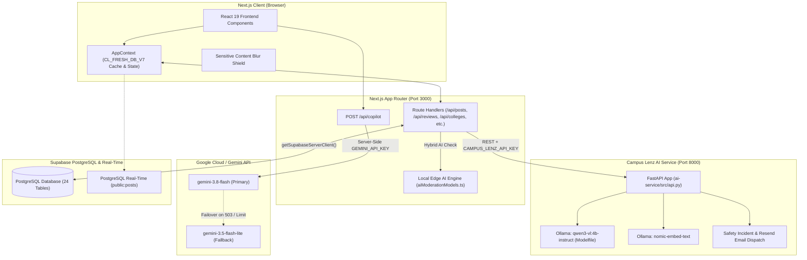
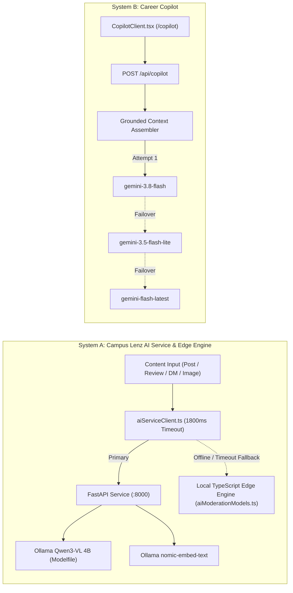
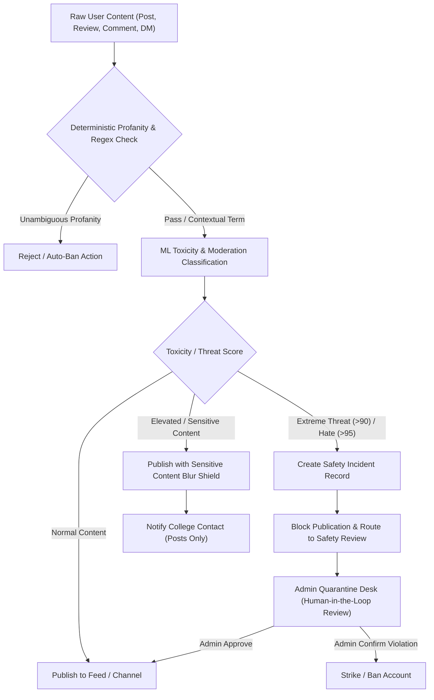

# Campus Lenz

> **The Unified Higher Education Ecosystem & Career Intelligence Platform**  
> Connecting students, alumni mentors, academic faculty, and college administrators through authentic reviews, campus discovery, verified community networks, dual-layer open-source AI moderation, and personalized career roadmaps.

---

## Table of Contents

1. [Project Overview & Problem Statement](#1-project-overview--problem-statement)
2. [Implementation Status Summary](#2-implementation-status-summary)
3. [System Architecture](#3-system-architecture)
4. [User Roles & Portal Experiences](#4-user-roles--portal-experiences)
5. [Core Product Modules](#5-core-product-modules)
   - [College Discovery & Multi-Dimensional Comparison](#college-discovery--multi-dimensional-comparison)
   - [Authentic Review & Aspect-Based Sentiment System](#authentic-review--aspect-based-sentiment-system)
   - [Campus Social Feed & Real-Time Engagement](#campus-social-feed--real-time-engagement)
   - [Campus Connect Hub (Discord Servers, Channels & DMs)](#campus-connect-hub-discord-servers-channels--dms)
   - [Student Academic Features Hub (Study Rooms, Q&A, Tasks)](#student-academic-features-hub-study-rooms-qa-tasks)
   - [Confidential Grievance & Anti-Ragging Desk](#confidential-grievance--anti-ragging-desk)
   - [Alumni Mentorship & Job Referral Network](#alumni-mentorship--job-referral-network)
   - [Faculty Academic Desk & Office Hours](#faculty-academic-desk--office-hours)
   - [Institutional Administration & Broadcasts](#institutional-administration--broadcasts)
   - [Root Administration & Telemetry Console](#root-administration--telemetry-console)
6. [Dual AI Architecture](#6-dual-ai-architecture)
   - [System A: Campus Lenz AI Service (Ollama / Local Edge)](#system-a-campus-lenz-ai-service-ollama--local-edge)
   - [System B: Career Copilot (Google Gemini Placement Strategist)](#system-b-career-copilot-google-gemini-placement-strategist)
7. [AI Safety, Moderation & Trust Engine](#7-ai-safety-moderation--trust-engine)
8. [Technology Stack](#8-technology-stack)
9. [Project Directory Structure](#9-project-directory-structure)
10. [API Route Reference](#10-api-route-reference)
    - [Next.js App Router API Routes](#nextjs-app-router-api-routes)
    - [10 Python FastAPI routes (8 functional AI endpoints + health/root endpoints)](#10-python-fastapi-routes-8-functional-ai-endpoints--healthroot-endpoints)
11. [Data Models & Schema](#11-data-models--schema)
12. [Environment Variables](#12-environment-variables)
13. [Getting Started & Local Development](#13-getting-started--local-development)

---

## 1. Project Overview & Problem Statement

### The Problem
Higher education discovery and campus engagement in India suffer from acute information asymmetry:
- Prospective students face promotional marketing brochures with unverified placement claims and generic rankings, lacking granular insight into campus life, mess food quality, hostel curfews, and true academic rigor.
- Current university students lack dedicated institutional communication channels, study rooms, anonymous grievance avenues, and transparent placement preparation roadmaps.
- Alumni networks remain isolated on external networks, making junior mentorship and referral distribution sporadic.
- Colleges struggle to moderate toxic campus discourse and disseminate emergency circulars efficiently.

### The Campus Lenz Solution
Campus Lenz creates an integrated digital campus operating system that bridges these divides:
- **Evidence-Based Discovery**: Granular profiles and side-by-side comparisons of colleges (with an extensive regional dataset covering Tamil Nadu engineering institutions) across 5 core dimensions: Placements, Fees & ROI, Academics, Campus Amenities, and Student Activities.
- **Audited Student Reviews**: Multi-dimensional reviews written by verified students and alumni, enriched with automated Aspect-Based Sentiment Analysis (ABSA) and official institutional reply threads.
- **Safe Campus Discourse**: Real-time social feeds and Discord-like campus channels governed by deterministic platform rules, multi-label toxicity filters, and automated sensitivity shields.
- **Confidential Grievance Portal**: Secure, tracking-enabled grievance escalation for ragging, harassment, and infrastructure failure.
- **Career Copilot AI**: A placement strategist grounded in actual campus placement baselines, student skills, and academic milestones, delivering structured placement roadmaps powered by Google Gemini.

---

## 2. Implementation Status Summary

To ensure absolute technical accuracy, features are classified according to their presence in the active codebase:

| Capability / Module | Implementation Status | Grounding Source in Repository |
| :--- | :--- | :--- |
| **Authentication & Role Portals** | **Implemented** | `src/app/login/LoginClient.tsx`, `src/lib/AppContext.tsx` |
| **Role Personas (Student, Alumni, Faculty, Institution, Admin)** | **Implemented** | `src/components/RolePersonaSwitcher.tsx`, `src/types/index.ts` |
| **College Discovery & Filtering** | **Implemented** | `src/components/ExploreCompareHub.tsx`, `src/lib/tamilNaduColleges.ts` |
| **Multi-College Comparison (2-3 colleges)** | **Implemented** | `src/components/ExploreCompareHub.tsx` (`/compare`) |
| **Review System & 8-Dimension Ratings** | **Implemented** | `src/app/colleges/[slug]/CollegeDetailClient.tsx`, `/api/reviews` |
| **Social Feeds, Likes, Reposts & Comments** | **Implemented** | `src/app/HomePageClient.tsx`, `/api/posts`, `/api/posts/[id]/...` |
| **Campus Servers & Channel Chat** | **Implemented** | `src/app/servers/ServersClient.tsx`, `src/components/CampusConnectHub.tsx` |
| **Direct 1:1 Messaging** | **Implemented** | `src/app/messages/MessagesClient.tsx`, `/api/direct-messages` |
| **Confidential Grievance Desk** | **Implemented** | `src/app/grievance/GrievanceClient.tsx`, `/api/grievances` |
| **Student Features Hub (Study Rooms, Q&A, Tasks)** | **Implemented** | `src/components/student/StudentFeaturesHub.tsx` |
| **Alumni Hub (Mentorship Slots, Referrals, AMAs)** | **Implemented** | `src/components/home/AlumniHomeView.tsx` |
| **Faculty Desk (Office Hours, Research, Lecture Notes)** | **Implemented** | `src/components/home/FacultyHomeView.tsx` |
| **Institution Desk (Broadcasts, Community Approvals)** | **Implemented** | `src/components/home/InstitutionHomeView.tsx`, `EmergencyBroadcastBanner.tsx` |
| **Admin Governance Console & Terminal** | **Implemented** | `src/app/admin/AdminClient.tsx`, `/api/audit-logs` |
| **Career Copilot AI (Gemini Placement Strategist)** | **Implemented** | `src/app/copilot/CopilotClient.tsx`, `src/app/api/copilot/route.ts` |
| **Campus Lenz AI Service (FastAPI + Ollama Qwen/Nomic)** | **Implemented** | `ai-service/src/api.py`, `ai-service/Modelfile` |
| **Local Edge AI Heuristic Engine (Offline Fallback)** | **Implemented** | `src/lib/aiModerationModels.ts`, `src/lib/aiServiceClient.ts` |
| **Dual-Tier State (localStorage + Supabase Sync)** | **Implemented** | `src/lib/AppContext.tsx` (`CL_FRESH_DB_V7`), `src/lib/supabase.ts` |
| **PostgreSQL Database Schema & Seed Script** | **Implemented** | `supabase_schema.sql`, `src/app/api/seed/route.ts` |
| **Native Mobile App (React Native / Flutter)** | **Planned / Future** | Not implemented (PWA install prompt implemented) |
| **Third-Party Payment Gateway for Marketplace** | **Planned / Future** | Reservation-only model implemented; payment gateway not present |
| **WebRTC Live Audio/Video for Study Rooms** | **Planned / Future** | Pomodoro & participant state implemented; WebRTC media streaming not present |

---

## 3. System Architecture



---

## 4. User Roles & Portal Experiences

The platform implements six explicit role classifications defined in [`src/types/index.ts`](file:///c:/campuslenzapp/src/types/index.ts):

### 1. Student (`role: 'student'`)
- Access to campus discussion feeds and role-filtered student stream.
- Interaction with **Career Copilot** for placement preparation, skill gap audits, and learning path recommendations.
- Interactive **Student Features Hub**: Pomodoro virtual study rooms, course Q&A, campus marketplace (book/dorm item reservations), and assignment/exam milestones tracker.
- Participation in Discord-style campus servers and confidential grievance submissions.
- Authoring multi-dimensional college reviews.

### 2. Alumni (`role: 'alumni'`)
- Dedicated **Alumni Mentorship View** (`src/components/home/AlumniHomeView.tsx`).
- Creation of career mentorship posts with anti-spam rate limiting: must meet follower minimums and adhere to weekly post quotas (`checkAlumniPostEligibility`).
- Publishing and managing **1:1 Mentorship Slots** (topic, meeting link, date/time) bookable by students.
- Posting **Job Referrals** (company, role, experience requirement) and reviewing incoming student referral requests.
- Hosting and participating in **Industry AMA (Ask-Me-Anything)** sessions with question upvoting.

### 3. Faculty (`role: 'faculty'`)
- Dedicated **Faculty Academic Desk** (`src/components/home/FacultyHomeView.tsx`).
- Publishing official departmental announcements, research advisories, and student project calls.
- **Office Hours Queue Management**: Real-time virtual queue allowing professors to admit, consult, and resolve waiting students.
- **Research Lab Openings**: Posting research opportunities and evaluating student applications (GPA, statement of interest, CV links).
- **Lecture Materials Repository**: Uploading and distributing versioned lecture notes and course reference materials.
- Submitting requests to the institution to provision new departmental or research servers.

### 4. Institution (`role: 'institution'`)
- Dedicated **Campus Administration Gateway** (`src/components/home/InstitutionHomeView.tsx`).
- Triggering high-priority **Emergency Broadcast Banners** that render across all client interfaces (`EmergencyBroadcastBanner.tsx`).
- Reviewing and approving/rejecting faculty community creation requests.
- Providing verified **Official Institutional Replies** to student and alumni college reviews.
- Reviewing reported campus posts and tracking campus engagement metrics.
- Governing institutional servers and channels (`src/app/servers/ServersClient.tsx`).

### 5. Staff (`role: 'staff'`)
- Recognized role type within authentication and user models for administrative assistants, lab superintendents, and campus facility coordinators (`officeTitle`, `aisheCode`, `facultyStaffId`).

### 6. System Administrator (`role: 'admin'`)
- Access to the **Root Administration Console** (`src/app/admin/AdminClient.tsx`).
- Real-time diagnostic monitor for the Campus Lenz AI Service and edge fallback models.
- Interactive AI testing playground for sentiment, aspect-based sentiment, review summarization, duplicate detection, and visual safety.
- Dynamic AI policy configuration: adjust auto-ban thresholds, sensitive content blur thresholds, and auto-ban triggers.
- Moderation queue management: reviewing quarantined posts and flagged user content.
- User account controls: striking, banning, unbanning, and removing accounts.
- Integrated **Admin Terminal** executing live diagnostic and operational commands (`status`, `users`, `posts`, `quarantine`, `audit`, `sync`, `flush`).

---

## 5. Core Product Modules

### College Discovery & Multi-Dimensional Comparison
- **Directory**: Comprehensive repository of Indian colleges with specialized depth in Tamil Nadu institutions (`src/lib/tamilNaduColleges.ts`).
- **Granular Data Points**:
  - *Placements*: Highest CTC, average CTC, median CTC, placement rate, top recruiters, tier-1 hire count, and structured training details.
  - *Fees & ROI*: Annual tuition, annual hostel fee, monthly mess fee, available scholarships, and overall Return-On-Investment score.
  - *Academics*: Faculty-student ratio, Ph.D. faculty percentage, curriculum revision frequency, and accreditation grades (NAAC/NBA).
  - *Campus & Hostel Amenities*: Hostel Wi-Fi bandwidth, curfew times, mess food rating, and proximity to emergency medical facilities.
  - *Activities & Ecosystem*: Annual technical symposiums, hackathon count, active student clubs, and funded incubation center support.
- **Multi-College Comparison Tool** (`/compare`): Direct side-by-side benchmarking of 2 or 3 colleges with visual delta analysis and category highlights.

### Authentic Review & Aspect-Based Sentiment System
- **Dimensional Ratings**: 1-to-5 star ratings across 8 distinct dimensions: Academics, Faculty, Placements, Infrastructure, Hostel, Campus Life, Value for Money, and Student Experience.
- **Structured Review Fields**: Title, detailed experience, pros list, cons list, advice to juniors, course/batch metadata, and an optional anonymity toggle.
- **Official Institutional Replies**: Verified institution profiles can publish formal responses directly attached to student reviews.
- **Automated AI Review Analysis**: Each review is processed by the AI pipeline to detect mentioned aspects and classify aspect-specific sentiment (positive, negative, neutral).

### Campus Social Feed & Real-Time Engagement
- **Dynamic Stream Filtering**: Switch seamlessly between *All Posts*, *Student Stream*, *Campus Feed*, *Alumni Feed*, and *Faculty Feed*.
- **Rich Post Creation**: Text posts with media URL attachments (images, video embeds), designated academic topics, and author verification indicators.
- **Social Actions**: Instant liking, threaded commenting, bookmarking, and cross-reposting to institutional walls.
- **Live Feed Engine**: Toggle real-time simulation updates or subscribe to live Supabase Postgres change events (`public:posts`).

### Campus Connect Hub (Discord Servers, Channels & DMs)
- **Discord-Style Servers** (`/servers`): Hierarchical server navigation with categorized text channels (`#general`, `#announcements`, `#placements`, `#code-collab`).
- **Channel Messaging**: Real-time channel discussion with message history and sender badges.
- **Direct 1-to-1 Messaging** (`/messages`): Private communication channels between students, alumni, and faculty, protected by automated message toxicity preflight screening.

### Student Academic Features Hub (Study Rooms, Q&A, Tasks)
- **Virtual Study Rooms**: Active focus rooms with synchronized Pomodoro timers, subject topics, and participant tracking.
- **Course Q&A**: Question and answer forum categorized by course code, equipped with peer upvoting and verified faculty answers.
- **Campus Marketplace**: Peer-to-peer textbook, laboratory gear, and dorm equipment reservations with status indicators (`available`, `reserved`).
- **Academic Task Tracker**: Personal assignment tracker with urgency indicators and countdown milestones for upcoming semester examinations.

### Confidential Grievance & Anti-Ragging Desk
- **Confidential Reporting** (`/grievance`): Secure grievance submission pipeline for ragging, harassment, grading bias, hostel failures, or administrative misconduct.
- **Confidentiality Options**: Submit under verified student profile or with complete anonymity.
- **Ticket Tracking**: Each grievance generates a unique tracking ID (`GRV-XXXXXX`) allowing students to monitor status updates (`submitted`, `under_investigation`, `resolved`, `action_taken`) and view administrative resolution notes.

---

## 6. Dual AI Architecture

Campus Lenz employs two distinct, specialized AI subsystems designed for resilience, safety, and student career acceleration.



### System A: Campus Lenz AI Service (Ollama / Local Edge)
The platform content intelligence and moderation engine is orchestrated by [`src/lib/aiServiceClient.ts`](file:///c:/campuslenzapp/src/lib/aiServiceClient.ts) using a hybrid bridge:
1. **External Python FastAPI Service** (`ai-service/src/api.py` running on port 8000):
   - **Language & Vision Model**: `qwen3-vl:4b-instruct` loaded via Ollama using the repository's custom [`ai-service/Modelfile`](file:///c:/campuslenzapp/ai-service/Modelfile). Executes post analysis, review aspect analysis, review summarization, and multimodal image analysis (OCR extraction + college relevance classification).
   - **Embedding Model**: `nomic-embed-text` via Ollama for semantic college search and duplicate text detection.
   - **Policy Engine**: Deterministic profanity filtering, targeted abuse detection, and safety incident logging (`ai-service/src/policy_filter.py`, `moderation_engine.py`).
   - **Email Notifications**: Automated alerts to verified college administrators via the Resend API when sensitive or harmful incidents are created.
2. **Local TypeScript Edge Engine** (`src/lib/aiModerationModels.ts`):
   - High-speed, zero-dependency offline fallback engine modeled on open-source ML architectures (`distilbert-base-uncased-finetuned-sst-2-english`, `unitary/toxic-bert`, `nsfwjs-mobilenet-v2`).
   - Automatically activates if the Python AI service or Ollama is offline or times out (1800ms threshold), guaranteeing 100% platform uptime and zero client-facing errors.

### System B: Career Copilot (Google Gemini Placement Strategist)
Career Copilot is an AI placement mentor and career strategist accessible at `/copilot`.
- **UI Route**: `src/app/copilot/page.tsx` (`CopilotClient.tsx`).
- **Server API Route**: `src/app/api/copilot/route.ts` (`POST /api/copilot`).
- **Gemini SDK**: Official `@google/genai` TypeScript SDK (v2.24.0).
- **Model Cascading Strategy**:
  1. `gemini-3.8-flash` (Primary high-performance reasoning model)
  2. `gemini-3.5-flash-lite` (Automatic failover during transient spikes or 503 high-demand events)
  3. `gemini-flash-latest` (Secondary fallback)
- **Grounded Student Context**:
  The server-side route constructs a system instruction incorporating live data:
  - *Student Profile*: Full name, college, department, degree course, graduation batch year.
  - *Career Profile*: Target career role, verified skills list, topics currently learning, completed milestones.
  - *Campus Placement Baseline*: College highest package, average package, top recruiters, tier-1 placement numbers.
  - *Academic Tasks*: Current coursework tasks and remaining days to semester exam milestones.
- **Strict Operating Guidelines**:
  - Grounds all recommendations strictly in supplied student and college placement data without hallucinating unverified credentials.
  - Enforces objective skill-gap analysis comparing current abilities against industry expectations.
  - Generates phased, actionable roadmaps tailored to the student's graduation timeline.
  - Never guarantees employment or specific salary packages.
  - Recommends Campus Lenz platform actions (booking an alumni mentor, requesting an alumni job referral, joining a study room, or asking in course Q&A).
- **Security**: The `GEMINI_API_KEY` is consumed strictly within the server-side Next.js route handler and is never exposed to the browser.

---

## 7. AI Safety, Moderation & Trust Engine

Campus Lenz enforces a multi-tier safety architecture combining deterministic rules, machine learning classifications, and human-in-the-loop administrative authority:



### Safety Classifications
- **Normal**: Safe, productive collegiate content; published immediately.
- **Sensitive**: Contains sensitive personal disclosures, distress, or controversial feedback; published with an automated **Sensitive Content Blur Shield** that requires user click-to-view.
- **Spam**: Repetitive, promotional, or off-topic content; rejected.
- **Potentially Harmful**: Severe harassment, direct threats of violence, or hate speech; blocked from publication and routed to the internal Safety Review desk.

### Deterministic & Contextual Profanity Filters
- Maintains a 48-term strict profanity dictionary with natural plural expansions (`policy_filter.py`).
- Contextual filtering evaluates ambiguous terms (`hell`, `damn`, `cocky`, `bloody`) to distinguish abusive attacks (`go to hell`) from legitimate colloquial feedback (`hostel food is damn bad`).

### Privacy Safeguards
- When direct messages between users trigger safety flags, an internal safety incident is created for platform administrators, but notifications are **never sent to college administrators**, preserving student communication privacy.

### Human-in-the-Loop Governance
- The AI engine never makes autonomous account deletion decisions. Extreme violations trigger recommendations (`actionRecommended: 'auto_ban'` or `'quarantine'`), leaving final adjudication to platform administrators via the Admin Console.

---

## 8. Technology Stack

### Frontend Application
- **Core Framework**: Next.js 16.3.6 (App Router, Server Components & Route Handlers)
- **UI Runtime**: React 19.2.8 & React DOM 19.2.8
- **Language**: TypeScript 5
- **Styling**: Tailwind CSS 4 (`@tailwindcss/postcss`) with custom glassmorphism design tokens
- **Motion & Transitions**: Framer Motion 13.4.4
- **Icons**: Lucide React 1.48.0
- **Class Utilities**: `clsx` 2.1.1, `tailwind-merge` 3.7.0

### Backend & Cloud Services
- **API Runtime**: Next.js App Router API Route Handlers (`src/app/api/*`)
- **Database & Authentication**: Supabase (`@supabase/supabase-js` 2.117.2, `@supabase/ssr` 0.12.7)
- **Database Engine**: PostgreSQL with 24 relational tables and real-time subscription channels
- **Client Cache**: Synchronized browser `localStorage` engine (`CL_FRESH_DB_V7`)

### AI & Machine Learning Subsystems
- **Career Copilot AI**: Google Gemini API via `@google/genai` (v2.24.0)
- **Microservice Backend**: Python FastAPI 0.141.1, Uvicorn 0.54.0
- **Local LLM Engine**: Ollama running `qwen3-vl:4b-instruct` (customized via `Modelfile`)
- **Embedding Engine**: Ollama running `nomic-embed-text`
- **Rate Limiting**: SlowAPI 0.1.10, Limits 5.8.0
- **Email Dispatch**: Resend 2.48.0
- **Edge Heuristic Fallback**: Custom TypeScript neural-rule matrix (`aiModerationModels.ts`)

---

## 9. Project Directory Structure

```
campuslenzapp/
├── ai-service/                         # Python FastAPI AI Microservice
│   ├── src/
│   │   ├── api.py                      # FastAPI application, rate limiter & routes
│   │   ├── moderation_engine.py        # Moderation logic & safety incident generator
│   │   ├── policy_filter.py            # Strict & contextual profanity dictionary
│   │   ├── post_analyzer.py            # LLM prompt & schema for post analysis
│   │   ├── review_analyzer.py          # LLM aspect-based sentiment analysis
│   │   ├── review_summarizer.py        # LLM multi-review synthesis
│   │   ├── image_analyzer.py           # Multimodal visual categorization & OCR
│   │   ├── embedding_service.py        # Ollama vector embeddings & cosine similarity
│   │   ├── duplicate_detector.py       # Cosine duplicate text scoring
│   │   ├── semantic_search.py          # College catalog semantic search
│   │   ├── notification_service.py     # Email notifications via Resend
│   │   └── safety_incident.py          # Safety incident data structures
│   ├── Modelfile                       # Ollama custom system prompt & model definition
│   └── requirements.txt                # Python dependencies (FastAPI, uvicorn, resend)
│
├── public/                             # Static assets, logos & PWA icons
│
├── src/
│   ├── app/                            # Next.js App Router routes & pages
│   │   ├── page.tsx                    # Main landing & role feed container
│   │   ├── HomePageClient.tsx          # Feed streams, stories & shortcuts client
│   │   ├── layout.tsx                  # Root HTML layout & AppProvider wrapper
│   │   ├── globals.css                 # Tailwind CSS 4 global style definitions
│   │   │
│   │   ├── admin/                      # Platform administration & AI console
│   │   ├── colleges/[slug]/            # College detail profiles & reviews
│   │   ├── compare/                    # Multi-college comparative analytics
│   │   ├── connect/                    # Unified campus connection hub
│   │   ├── copilot/                    # Career Copilot placement strategist
│   │   ├── create/                     # Post & review creation studio
│   │   ├── explore/                    # College search & directory filtering
│   │   ├── grievance/                  # Confidential grievance submission & tracking
│   │   ├── login/                      # Portal-based authentication
│   │   ├── register/                   # Role-specific user registration
│   │   ├── messages/                   # Direct 1:1 user messaging
│   │   ├── profile/                    # User profile view & editor
│   │   ├── servers/                    # Discord-style campus server browser
│   │   ├── user/[username]/            # Public user profiles & user follow system
│   │   │
│   │   └── api/                        # Next.js server-side API route handlers
│   │       ├── ai/                     # AI proxy & diagnostic routes
│   │       ├── colleges/               # College directory CRUD
│   │       ├── copilot/                # Gemini Career Copilot endpoint
│   │       ├── posts/                  # Feed posts, likes, reposts, comments
│   │       ├── reviews/                # College reviews & replies
│   │       ├── users/                  # User profiles & follow actions
│   │       ├── communities/            # Discord server definitions
│   │       ├── server-messages/        # Server channel chat messages
│   │       ├── direct-messages/        # Private user direct messages
│   │       ├── grievances/             # Grievance reports & resolutions
│   │       ├── study-rooms/            # Virtual study rooms & timers
│   │       ├── course-questions/       # Course Q&A forum
│   │       ├── marketplace/            # Peer marketplace item listings
│   │       ├── audit-logs/             # Administrative audit trail
│   │       └── seed/                   # Database seeding utility
│   │
│   ├── components/                     # Reusable React components
│   │   ├── Navigation.tsx              # Responsive top navigation & role badges
│   │   ├── RolePersonaSwitcher.tsx     # Instant demo persona switcher
│   │   ├── CampusConnectHub.tsx        # Servers, channels & direct message client
│   │   ├── ExploreCompareHub.tsx       # College discovery & side-by-side comparison
│   │   ├── StudentSkillsSection.tsx    # Interactive student skill badges
│   │   ├── EmergencyBroadcastBanner.tsx# Real-time institutional emergency banner
│   │   ├── FollowersListModal.tsx      # Follower / following list modal
│   │   ├── EditProfileModal.tsx        # Profile editing modal
│   │   ├── PWAInstallPrompt.tsx        # Progressive Web App installer prompt
│   │   ├── home/                       # Role-specific home view interfaces
│   │   │   ├── AlumniHomeView.tsx      # Mentorship, referrals, AMAs
│   │   │   ├── FacultyHomeView.tsx     # Office hours, lab openings, notes
│   │   │   └── InstitutionHomeView.tsx # Circulars, approvals, broadcasts
│   │   └── student/
│   │       └── StudentFeaturesHub.tsx  # Study rooms, Q&A, marketplace, tasks
│   │
│   ├── lib/                            # Core application logic & data providers
│   │   ├── AppContext.tsx              # Global state, authentication & data syncing
│   │   ├── aiServiceClient.ts         # Hybrid client connecting FastAPI & edge engine
│   │   ├── aiModerationModels.ts       # Zero-dependency local AI heuristic models
│   │   ├── supabase.ts                 # Supabase client & server-side helpers
│   │   ├── mockData.ts                 # Seed datasets for all 24 entities
│   │   ├── tamilNaduColleges.ts        # Comprehensive regional colleges database
│   │   └── mediaUtils.ts               # Media helpers for video/image detection
│   │
│   ├── types/
│   │   └── index.ts                    # Complete TypeScript definitions & interfaces
│   │
│   └── utils/
│       └── supabase/                   # Supabase SSR browser & server helpers
│
├── supabase_schema.sql                 # Complete PostgreSQL database schema (24 tables)
├── package.json                        # Node dependencies & project scripts
└── tsconfig.json                       # TypeScript compiler configuration
```

---

## 10. API Route Reference

### Next.js App Router API Routes

#### AI & Moderation
- `GET /api/ai/status` — Returns diagnostic health metrics for both the external FastAPI service and local edge engines.
- `POST /api/ai/analyze-post` — Analyzes a post for sentiment, category, toxicity, and platform policy compliance.
- `POST /api/ai/analyze-message` — Preflight toxicity and threat analysis for private direct messages.
- `POST /api/ai/summarize-reviews` — Generates a structured multi-review summary with positive and negative points.
- `POST /api/ai/detect-duplicate` — Computes semantic similarity between two texts using vector cosine proximity.
- `POST /api/ai/semantic-search` — Performs semantic vector search across the college catalog.

#### Career Copilot
- `POST /api/copilot` — Secure server-side endpoint connecting to Google Gemini (`gemini-3.8-flash` with cascading fallback) to deliver grounded student career mentorship and placement preparation plans.

#### Colleges & Discovery
- `GET /api/colleges` — Fetches the list of colleges with optional state, tier, and search query filters.
- `GET /api/colleges/[slug]` — Retrieves full profile details for a specific college by its slug.

#### Social Feed & Posts
- `GET /api/posts` — Retrieves published posts with support for college, role, and sentiment filtering.
- `POST /api/posts` — Creates a new post with automated AI preflight moderation and sensitivity evaluation.
- `GET /api/posts/[id]` — Retrieves a single post by ID.
- `DELETE /api/posts/[id]` — Deletes a post (author or administrator only).
- `POST /api/posts/[id]/comments` — Adds a threaded comment to a post.
- `POST /api/posts/[id]/like` — Toggles a user like on a post.
- `POST /api/posts/[id]/repost` — Toggles a repost of a post.

#### Reviews
- `GET /api/reviews` — Retrieves reviews filtered by `collegeId` or `userId`.
- `POST /api/reviews` — Submits a new multi-dimensional review with automated aspect sentiment tagging.

#### Communities & Messaging
- `GET /api/communities` — Fetches all configured Discord-style campus servers.
- `POST /api/communities` — Creates a new campus server.
- `GET /api/server-messages` — Retrieves chat messages for a specific channel ID.
- `POST /api/server-messages` — Publishes a message to a server channel.
- `GET /api/direct-messages` — Retrieves private 1:1 messages between two users.
- `POST /api/direct-messages` — Sends a private direct message after safety preflight check.

#### Academic & Student Tools
- `GET /api/study-rooms` — Lists active virtual study rooms and Pomodoro focus sessions.
- `POST /api/study-rooms` — Creates a new study room.
- `GET /api/course-questions` — Lists course Q&A questions with answers and vote counts.
- `POST /api/course-questions` — Submits a new course question or answer.
- `GET /api/marketplace` — Retrieves campus marketplace items.
- `POST /api/marketplace` — Creates a new marketplace listing.

#### Grievances
- `GET /api/grievances` — Retrieves grievance reports (restricted by user or institutional scope).
- `POST /api/grievances` — Submits a confidential grievance report generating a tracking code.

#### Users & Follow Network
- `GET /api/users` — Lists user profiles.
- `GET /api/users/[username]` — Retrieves a public user profile by username.
- `POST /api/users/[username]/follow` — Toggles follow/unfollow state between users.

#### Governance & Utilities
- `GET /api/audit-logs` — Retrieves platform administrative audit logs.
- `POST /api/seed` — Seeds Supabase database tables with initial college and user fixtures.

---

### 10 Python FastAPI routes (8 functional AI endpoints + health/root endpoints)
*(Running on port 8000 when active)*
- `GET /` — Service identity and version check.
- `GET /health` — Service health probe.
- `POST /analyze/post` — LLM-driven post sentiment, topic classification, and moderation check.
- `POST /moderate/post` — Decides policy action (`publish`, `safety_review`, `reject`) and creates incidents.
- `POST /analyze/review` — Aspect-based sentiment analysis for reviews.
- `POST /moderate/review` — Moderation evaluation for student reviews.
- `POST /moderate/message` — Evaluates direct messages with privacy safeguards.
- `POST /analyze/summary` — Multi-review synthesis using Ollama.
- `POST /analyze/image` — Multimodal image categorization, OCR extraction, and relevance scoring.
- `POST /search/colleges` — Vector-based semantic college search.

---

## 11. Data Models & Schema

The application is architected around 24 primary entities defined in [`src/types/index.ts`](file:///c:/campuslenzapp/src/types/index.ts) and backed by PostgreSQL tables in [`supabase_schema.sql`](file:///c:/campuslenzapp/supabase_schema.sql):

### Core Entities
1. **`UserProfile`**: User accounts across all roles (`student`, `alumni`, `faculty`, `institution`, `staff`, `admin`), storing institutional metadata, verification flags, follower arrays, strike counts, and the optional `StudentCareerProfile`.
2. **`StudentCareerProfile`**: Embedded career state:
   - `targetRole`: Target career title (e.g. *Software Development Engineer*).
   - `skills`: Array of verified technical skills.
   - `currentLearning`: Array of topics currently being studied.
   - `completedLearning`: Array of completed courses or milestones.
   - `updatedAt`: ISO timestamp of the last career profile update.
3. **`College`**: Comprehensive institutional profile containing slug, contact info, courses, departments, fee ranges, average rating, review count, and nested objects: `placementDetails`, `feeDetails`, `academicDetails`, `campusDetails`, `activityDetails`, and `overallScore`.
4. **`CollegeReview`**: Multi-dimensional student evaluation containing 1-5 star ratings across 8 dimensions, pros/cons, advice, and optional `institutionReply`.
5. **`Post`**: Social feed post with rich media, topic tags, like arrays, repost tracking, sentiment scores, and moderation flags (`isSensitive`, `isQuarantined`).
6. **`Comment`**: Threaded discussion entry tied to a post.
7. **`DiscordServer` & `ServerChannel`**: Channel-based campus communication servers.
8. **`ServerMessage`**: Chat messages within server channels.
9. **`DirectMessage`**: Private 1:1 direct messages with confidentiality controls and safety review suppression.
10. **`PrivateGrievanceReport`**: Confidential reports with tracking IDs, status lifecycle, and resolution notes.
11. **`StudyRoom`**: Virtual focus room with subject topic and Pomodoro timer.
12. **`CourseQuestion` & `CourseAnswer`**: Coursework Q&A entries with peer upvotes.
13. **`MarketplaceItem`**: Student listing for books, calculators, and dorm gear.
14. **`AssignmentTask`**: Academic deliverables with urgency ratings.
15. **`ExamMilestone`**: Semester examination date countdowns.
16. **`MentorshipSlot`**: Bookable 1:1 alumni mentorship sessions.
17. **`AlumniJobReferral` & `ReferralRequest`**: Verified alumni job postings and student referral applications.
18. **`IndustryAMAEvent`**: Scheduled alumni AMA forums with community questions.
19. **`OfficeHourQueueItem`**: Real-time virtual queue for faculty office consultations.
20. **`ResearchOpening` & `ResearchApplication`**: Faculty lab positions and student applications.
21. **`LectureMaterialVersion`**: Versioned academic course notes and references.
22. **`EmergencyBroadcast`**: High-priority campus alert banner.
23. **`AuditLogEntry`**: System security and governance audit trail.

---

## 12. Environment Variables

Create a `.env.local` file in the project root to configure external integrations. All variables are optional for initial local development thanks to built-in fallbacks.

```env
# -----------------------------------------------------------------------------
# Google Gemini API (Required for Career Copilot)
# -----------------------------------------------------------------------------
# Used server-side in src/app/api/copilot/route.ts. Never exposed to the browser.
GEMINI_API_KEY=your_google_gemini_api_key_here

# -----------------------------------------------------------------------------
# Supabase Configuration (Optional: Enables Cloud Database & Real-Time Sync)
# -----------------------------------------------------------------------------
# If omitted, Campus Lenz seamlessly operates using the local offline cache (CL_FRESH_DB_V7).
NEXT_PUBLIC_SUPABASE_URL=https://your-project.supabase.co
NEXT_PUBLIC_SUPABASE_ANON_KEY=your_supabase_anon_key_here
SUPABASE_SERVICE_ROLE_KEY=your_supabase_service_role_key_here

# -----------------------------------------------------------------------------
# Campus Lenz AI Microservice (Optional: Connects to local FastAPI + Ollama)
# -----------------------------------------------------------------------------
# If omitted or if service is offline, local TypeScript edge models handle requests.
NEXT_PUBLIC_AI_SERVICE_URL=http://127.0.0.1:8000
AI_SERVICE_URL=http://127.0.0.1:8000
CAMPUS_LENZ_API_KEY=your-local-api-key

# -----------------------------------------------------------------------------
# AI Microservice Environment (Configured in ai-service/.env)
# -----------------------------------------------------------------------------
# OLLAMA_EMBED_URL=http://localhost:11434/api/embed
# CAMPUS_LENZ_EMBED_MODEL=nomic-embed-text
# RESEND_API_KEY=your_resend_api_key_for_email_alerts
```

---

## 13. Getting Started & Local Development

### Prerequisites
- **Node.js**: `v18.18.0` or later (`v20+` recommended)
- **Package Manager**: `npm` (v9+)
- *(Optional for Career Copilot)*: A valid **Google Gemini API Key**
- *(Optional for Python AI Service)*: Python `3.10+` and [Ollama](https://ollama.ai/)

---

### Step 1: Install Dependencies
Clone the repository and install the frontend dependencies:
```bash
git clone https://github.com/your-username/campuslenzapp.git
cd campuslenzapp
npm install
```

---

### Step 2: Configure Environment Variables
Create a `.env.local` file in the repository root:
```bash
cp .env.example .env.local
```
Add your `GEMINI_API_KEY`:
```env
GEMINI_API_KEY=AIzaSy...
```

---

### Step 3: Run the Next.js Development Server
Start the Next.js application:
```bash
npm run dev
```
Open [http://localhost:3000](http://localhost:3000) in your browser. The application will start immediately using the local edge data cache and heuristic moderation models.

---

### Step 4: (Optional) Run the Campus Lenz Python AI Service
To enable local LLM post analysis, aspect-based sentiment, review summarization, and OCR:

1. **Install and run Ollama**:
   ```bash
   ollama pull qwen3-vl:4b-instruct
   ollama pull nomic-embed-text
   ```

2. **Create the custom model from Modelfile**:
   ```bash
   cd ai-service
   ollama create campus-lenz-ai -f Modelfile
   ```

3. **Install Python dependencies**:
   ```bash
   python -m venv venv
   # On Windows:
   .\venv\Scripts\activate
   # On Linux/macOS:
   source venv/bin/activate

   pip install -r requirements.txt
   ```

4. **Start the FastAPI server**:
   ```bash
   python src/api.py
   ```
   The AI service will be active at `http://127.0.0.1:8000`. Next.js will automatically detect it and route intelligence requests through FastAPI while retaining edge fallback capabilities.

---

### Step 5: (Optional) Connect Supabase PostgreSQL Database
1. Create a project on [Supabase](https://supabase.com).
2. Open the SQL Editor in your Supabase dashboard and run the complete schema script from [`supabase_schema.sql`](file:///c:/campuslenzapp/supabase_schema.sql).
3. Copy your project URL and keys into `.env.local`.
4. Run the seed endpoint once in your browser or terminal to populate initial data:
   ```bash
   curl -X POST http://localhost:3000/api/seed
   ```

---

### Project Scripts

| Command | Action |
| :--- | :--- |
| `npm run dev` | Starts the Next.js development server on port 3000 with hot reload. |
| `npm run build` | Compiles and optimizes the Next.js application for production. |
| `npm run start` | Starts the production server after running `npm run build`. |
| `npm run lint` | Runs ESLint to verify code style and detect linting errors. |

---

## License
This project is proprietary and confidential. Developed for the Campus Lenz Higher Education Initiative.
